<!--group_id:4e784292-6a65-471e-9f80-e91202e3358c update_at:2022-01-13.json-->

# 刘娟娟的朋友圈

### 2021-12-15 11:04:39

发布了回复：

{
  "group_id": "7dc87514-6106-495a-b9ef-9bcdfab736f8",
  "group_name": "娟娟的论坛",
  "owner_pubkey": "CAISIQPrm+MpODfGyQy1UMp/V+6hIW9abyToa4xBONwmXKuN6A==",
  "encryption_type": "public",
  "app_key": "group_post",
  "genesis_block": {
    "ProducerPubKey": "CAISIQPrm+MpODfGyQy1UMp/V+6hIW9abyToa4xBONwmXKuN6A==",
    "Hash": "IFdajWSNwmZ9PyJefimi13b7cKvTKiWVTwhyYu5c/VI=",
    "Signature": "MEUCIGVN9sy7zgZd7U/lipUPDP1X7api3PXySScsef03hSQfAiEAiV74rwLmRe36x7ZrTdn3YaoUeTJR4VWGYqn4xFRrpVo=",
    "TimeStamp": "1639537431853000000",
    "BlockId": "dcde5c64-3500-4380-b79f-9a5769a595f3",
    "GroupId": "7dc87514-6106-495a-b9ef-9bcdfab736f8"
  },
  "consensus_type": "poa",
  "cipher_key": "5e1fe17512db7fe04bbaec69b3d53cc874cb599dbc60c119c21c4f43c940b81e",
  "signature": "3046022100c7897dbb0cf581b67368e8f3a7de9cefc8254785d54243c8a7496fa27ab6fd1e022100c894b91e3d48a58d05384e2a8ef214d890e3e6c1d32d6d1166c99e49b81431b4"
}

回复给 `初生儿般的好奇心` 所发布的内容：

> 简书上，我之前发的，关于区块链技术基础知识的文章，居然属于敏感内容。。

<!--trx_id:55f8fe06-91e3-4d38-a414-93a9142b5666-->

### 2021-12-15 11:07:03

发布了回复：

{
  "group_name": "测试网页版",
  "consensus_type": "poa",
  "encryption_type": "public",
  "cipher_key": "764232e4cf3d18e371f0e104ff7176be105d0ca872ae9271a3a3446a441d351d",
  "app_key": "group_timeline",
  "signature": "3045022100e8a53cba89a6c9a63b01c96dd0169c0cde6a95d3994c84b2c281f5223ecd632f02204c5fc8a4eee777b58dcb1ef3577bf91e8a609a41212b9655e88b313d1ac8c8a7",
  "group_id": "20d26b37-72fc-40af-ac44-0eb56f71720a",
  "owner_pubkey": "CAISIQKJIwdWpASmoE//pHK8MO6pjAf9ownywGJbQLRpC7ci+A==",
  "genesis_block": {
    "Hash": "lDvHF8m4kyBQ4j92CuHFv2ti/L7q4wOpq1BjNZPxZI0=",
    "Signature": "MEUCIHZJ1ObYKtCrqt1UFsDMn5o29NSbymHIzHwMYsNkDW8eAiEApr9powslxpaOepd/pmwaYC3Q21i0QW+o1LdJNhc+frE=",
    "TimeStamp": "1639537602275000000",
    "BlockId": "5bc3cdbd-2752-48b9-98f0-d64cc1d564e4",
    "GroupId": "20d26b37-72fc-40af-ac44-0eb56f71720a",
    "ProducerPubKey": "CAISIQKJIwdWpASmoE//pHK8MO6pjAf9ownywGJbQLRpC7ci+A=="
  }
}

回复给 `初生儿般的好奇心` 所发布的内容：

> 简书上，我之前发的，关于区块链技术基础知识的文章，居然属于敏感内容。。

<!--trx_id:8cfba6de-1e74-4949-badb-6ead418ca7f7-->

### 2021-12-15 11:32:16

修改了个人信息。

<!--trx_id:75b4c308-6169-4dac-81a0-dbaef3ea2b93-->

### 2021-12-15 11:33:46

发布了内容：

TODO：云上部署代码运行环境。
<!--trx_id:6f7c6fd1-0afd-45f0-a5a4-cb44801e8aab-->

### 2021-12-15 11:34:02

发布了内容：

TODO：编译CLI版本并启用。
<!--trx_id:8f279d01-2eb9-4b32-8777-8fb46aa256cc-->

### 2021-12-15 11:35:18

发布了内容：

TODO：拆分代码为多进程。
<!--trx_id:dfdbc597-d0cb-4345-842c-b6e9e75f0012-->

### 2021-12-15 11:35:50

发布了内容：

TODO：session的连接与中断连接？
<!--trx_id:54740a21-976c-43b5-99d4-93900651c2bd-->

### 2021-12-15 11:36:01

发布了内容：

TODO：api交互。
<!--trx_id:71a3e324-bb5a-4030-8574-e896c4f825d3-->

### 2021-12-15 14:01:31

发布了内容：

观念决定思路，思路决定出路。
早上好。

<!--trx_id:d07e2e37-6468-4002-9059-3369be7edd81-->

### 2021-12-15 15:29:41

点赞给 `编程自由` 发布的内容。

> TODO：拆分代码为多进程。

<!--trx_id:bd4e5cf4-d020-4f97-8d68-2c2e5a7239ff-->

### 2021-12-15 15:37:41

发布了回复：

DONE：拆分代码为多进程。（scrawler、rumbot）

采用 Jupyter Lab 可以极低门槛地实现多进程 24H 同时工作。比如爬取微博资讯并推送的任务，可以拆分为：
一个进程爬取微博最新资讯。
一个进程把已经爬取到的、尚未推送的内容，推送出去。

潜在的问题是：两个进程都要频繁读写 同一批 json 文件，直觉可能会产生问题。
我习惯于每改写一个数值，就写一次文件存档。但要相信运行环境稳定后，可以降低写文件的频次。所以顺带把写文件的频次也改为每个 user 处理完再写入。
不用 json 文件而是改用本地数据库，可以不用担心文件读写频繁的问题，也不用担心多个进程频繁访问同一批文件。实现起来容易，之前玩过，但我不想让代码复杂化。够用就行。

回复给 `编程自由` 所发布的内容：

> TODO：拆分代码为多进程。

<!--trx_id:77056db2-c1b9-45a9-a348-230f6d5e46a0-->

### 2021-12-16 01:30:35

发布了回复：

DONE: api交互。

python 实现的话，就用 requests 库就好。建立 session 后，基本上就两大类方法：get，post
参数可以放在 url 里，也可以形成 json 传参。

当然，对方提供相应的api，自己提供正确的参数就能获取正确的反应。
如果不能，那么检查下是否需要 verify 或 token/key 之类的鉴权。

回复给 `编程自由` 所发布的内容：

> TODO：api交互。

<!--trx_id:8a045b8c-c69c-45b8-bb42-6b8ff6b3e7c8-->

### 2021-12-16 01:30:42

点赞给 `编程自由` 发布的内容。

> TODO：api交互。

<!--trx_id:ad3e6e28-0329-4204-b005-2b0de3df03a9-->

### 2021-12-16 14:19:31

发布了内容：

DONE：拆分代码为多进程。（scrawler、rumbot）

采用 Jupyter Lab 可以极低门槛地实现多进程 24H 同时工作。比如爬取微博资讯并推送的任务，可以拆分为：
一个进程爬取微博最新资讯。
一个进程把已经爬取到的、尚未推送的内容，推送出去。

潜在的问题是：两个进程都要频繁读写 同一批 json 文件，直觉可能会产生问题。
我习惯于每改写一个数值，就写一次文件存档。但要相信运行环境稳定后，可以降低写文件的频次。所以顺带把写文件的频次也改为每个 user 处理完再写入。
不用 json 文件而是改用本地数据库，可以不用担心文件读写频繁的问题，也不用担心多个进程频繁访问同一批文件。实现起来容易，之前玩过，但我不想让代码复杂化。够用就行。
<!--trx_id:59b1ff9b-ec13-4a62-ae9a-84d6c1014192-->

### 2021-12-16 14:20:00

发布了内容：

DONE: api 交互。

python 实现的话，就用 requests 库就好。建立 session 后，基本上就两大类方法：get，post
参数可以放在 url 里，也可以形成 json 传参。

当然，对方提供相应的api，自己提供正确的参数就能获取正确的反应。
如果不能，那么检查下是否需要 verify 或 token/key 之类的鉴权。

requests 的基本用法整理了一篇笔记。
<!--trx_id:1a3e4c35-b841-476f-9392-ff9ed1c5e195-->

### 2021-12-16 15:34:39

发布了内容：

TODO: 试玩 RUM api。
<!--trx_id:b56a41cd-b920-4269-8619-6b504114e593-->

### 2021-12-16 15:35:56

发布了内容：

TODO：ipynb与md的互相转换，代码最好拆成独立的，不依赖其它自定义类。
<!--trx_id:9d8f2162-e581-4f93-b3f9-b44a1b43d571-->

### 2021-12-16 15:36:22

发布了内容：

TODO: 发个requests基础用法文章。
<!--trx_id:4b4927c4-43af-4628-adcf-99b10ccbfc69-->

### 2021-12-16 15:36:48

发布了内容：

TODO: 本地 python 试玩 rum api 的文章。
<!--trx_id:edf94287-dbe5-4dda-8d71-d7cdd663f72d-->

### 2021-12-16 19:11:43

发布了回复：

极简：
1、先装 python,  官网下载，自带 pip
2、pip install jupyterlab
3、pip install xxx各种依赖的库，具体执行时遇到啥提示就装啥

回复给 `编程自由` 所发布的内容：

> TODO：云上部署代码运行环境。

<!--trx_id:a303e44b-7f46-4c3f-ab87-29fa8dd4f6e2-->

### 2021-12-17 13:05:03

发布了内容：

TODO：调用rum api 试试看能否把内容导出为 markdown 格式的数据。
<!--trx_id:d30c2f0d-3312-4191-ae4d-7f9b1f083211-->

### 2021-12-17 13:14:39

发布了内容：

TODO：追踪&推送 github repo commit 信息。
<!--trx_id:eb63aeb0-81fc-41c0-86fe-f1eb206f4dc2-->

### 2021-12-17 13:14:56

发布了内容：

TODO：试试看 whale 之类的链上数据追踪&推送。
<!--trx_id:edf0020f-9462-42d4-bff7-70688f85fd38-->

### 2021-12-17 14:47:33

点赞给 `编程自由` 发布的内容。

> TODO：试试看 whale 之类的链上数据追踪&推送。

<!--trx_id:a74766ac-f15a-4cba-aeda-ca8a0afc8e01-->

### 2021-12-17 14:47:39

发布了回复：

up

回复给 `编程自由` 所发布的内容：

> TODO：试试看 whale 之类的链上数据追踪&推送。

<!--trx_id:67555bfb-f094-4474-9ad2-ab0701b114ce-->

### 2021-12-17 14:47:42

点赞给 `编程自由` 发布的内容。

> up

<!--trx_id:2c310182-8449-43be-9334-cfa9cc1095c4-->

### 2021-12-17 14:47:50

发布了回复：

up

回复给 `编程自由` 所发布的内容：

> up

<!--trx_id:8b3bc279-646c-4803-9ada-fe731e7b4ee2-->

### 2021-12-17 14:47:56

点赞给 `编程自由` 发布的内容。

> up

<!--trx_id:213cbfb8-9778-4b37-ae59-01a70e150f31-->

### 2021-12-17 14:48:06

点踩给 `编程自由` 发布的内容。

> up

<!--trx_id:093aa9b4-f7cb-4d8a-8eec-7ceb4fac1101-->

### 2021-12-17 14:48:09

点赞给 `编程自由` 发布的内容。

> up

<!--trx_id:c63ec22a-9356-4477-890b-7334b8240d4c-->

### 2021-12-17 14:48:14

点赞给 `编程自由` 发布的内容。

> up

<!--trx_id:b821cf34-b54e-44c1-819a-841b3ab4d4fe-->

### 2021-12-17 14:50:11

点赞给 `编程自由` 发布的内容。

> up

<!--trx_id:5aeffd5a-7d76-4337-a80e-6d01d3831bc9-->

### 2021-12-17 14:50:16

点赞给 `编程自由` 发布的内容。

> up

<!--trx_id:3e0d3772-caf1-412c-b4e9-e04443426f93-->

### 2021-12-17 14:50:19

点赞给 `编程自由` 发布的内容。

> up

<!--trx_id:8f1bbfcb-1c7e-4262-a8e0-6d3fc722ed0d-->

### 2021-12-17 14:52:33

发布了内容：

掌握某种或多种编程语言的人，也是多语言使用者。不一定是英语、法语等母语之外的语种。
<!--trx_id:e80b087a-ab21-4587-8da8-2367788ca0cc-->

### 2021-12-18 00:09:17

发布了回复：

？

回复给 `某人` 所发布的内容：

> ...

<!--trx_id:4b284f56-8b17-4f4b-ab23-caa9eea9bbef-->

### 2021-12-18 10:11:39

点赞给 `bigSword` 发布的内容。

> 下一个功能有着落了：1. 可以dislike 2.每个人除了“忽略他”，还可以加filter，其中一个filter可以是群组管理员dislike的帖子不显示。

<!--trx_id:912c600d-836c-4953-abab-25d5638e9ce7-->

### 2021-12-18 11:02:21

发布了内容：

不管今天用多久的电子设备，都可以，只有一个条件：在走步机上边走边用。有感于昨天久坐、晚睡所带来的全身酸痛。。
<!--trx_id:38241edb-526d-4e47-bda3-2fae61cd557b-->

### 2021-12-18 11:10:24

点赞给 `文锋` 发布的内容。

> 保护好大长腿的膝盖即可😃

<!--trx_id:be30ab0c-4d4e-4928-a17d-6ddc508a1125-->

### 2021-12-19 23:24:02

发布了内容：

我在年轻时一定是看过《教父》三部曲的，勉强有一点印象，但又有理由怀疑多年前第一次看，并没有完整地看完三部曲。到了现如今，却能滋滋有味地看完三部曲。一是稍有能力撇开女性立场去看待男性视角，二是撇开浮华、猎奇，去看到家庭、亲情、责任，去看到几代人与时代相关的共振及宿命感...
<!--trx_id:02c23edc-be7d-4a32-bbae-fb8e179e9c5b-->

### 2021-12-19 23:33:23

发布了内容：

《教父2》的经典结尾~

<!--trx_id:2879a53f-d1c1-4bb3-b0ab-461289fc6081-->

### 2021-12-20 21:25:10

发布了内容：

Done：云上部署代码运行环境。

我有想过要不要编译成 .exe 直接一键提交/运行。
请教了下工程师，这不是python所擅长的，不如直接装python，直接运行.py文件。

极简：
1、先装 python,  官网下载，自带 pip
2、pip install jupyterlab
3、pip install xxx各种依赖的库，具体执行时遇到啥提示就装啥

连计划任务也不用设置了。
直接开着 jupyter ，持续运行就行。查看log还方便；debug也容易。
环境变量各种设置稍稍麻烦点，有点耐心。

不过我需要 24H 跑的几个脚本，有的要翻墙。在云上翻墙总有一种不安全感。
so...先这样吧。
或许改天可以买个海外的云也一起玩着。
<!--trx_id:224776b9-c219-475b-91b4-0f19609c48a8-->

### 2021-12-20 21:25:18

发布了回复：

Done：云上部署代码运行环境。

我有想过要不要编译成 .exe 直接一键提交/运行。
请教了下工程师，这不是python所擅长的，不如直接装python，直接运行.py文件。

极简：
1、先装 python,  官网下载，自带 pip
2、pip install jupyterlab
3、pip install xxx各种依赖的库，具体执行时遇到啥提示就装啥

连计划任务也不用设置了。
直接开着 jupyter ，持续运行就行。查看log还方便；debug也容易。
环境变量各种设置稍稍麻烦点，有点耐心。

不过我需要 24H 跑的几个脚本，有的要翻墙。在云上翻墙总有一种不安全感。
so...先这样吧。
或许改天可以买个海外的云也一起玩着。

回复给 `编程自由` 所发布的内容：

> TODO：云上部署代码运行环境。

<!--trx_id:a0471ff2-7a82-43e7-adc1-644be3df3d89-->

### 2021-12-20 21:25:57

点赞给 `编程自由` 发布的内容。

> TODO：云上部署代码运行环境。

<!--trx_id:3d3b755b-e0f7-47b3-9c89-32efa96096ed-->

### 2021-12-20 21:27:52

发布了回复：

Cancel：编译CLI版本并启用。

大概看了下 CLI，我可能还是对 python 用的更顺手。

用 RUM destop 版本就可以。
本地启动一个 Rum 桌面版。
然后用 python  requests 来访问 RUM 服务（也就是 quorum_win.exe），与 api 交互。

回复给 `编程自由` 所发布的内容：

> TODO：编译CLI版本并启用。

<!--trx_id:2322394a-8ae7-4e78-bdd2-fd210201f24b-->

### 2021-12-20 21:27:55

点赞给 `编程自由` 发布的内容。

> TODO：编译CLI版本并启用。

<!--trx_id:36a1f477-19f9-4abe-bbe9-6b5c5385e099-->

### 2021-12-20 21:27:59

发布了内容：

Cancel：编译CLI版本并启用。

大概看了下 CLI，我可能还是对 python 用的更顺手。

用 RUM destop 版本就可以。
本地启动一个 Rum 桌面版。
然后用 python  requests 来访问 RUM 服务（也就是 quorum_win.exe），与 api 交互。
<!--trx_id:e4811bb7-85a5-403b-b1df-8a1d6c9b0482-->

### 2021-12-20 21:29:58

点赞给 `编程自由` 发布的内容。

> TODO：session的连接与中断连接？

<!--trx_id:bdc2531e-e9ff-4f4c-877d-49b53fa53b7a-->

### 2021-12-20 21:30:02

发布了回复：

Done：session的连接与中断连接？

requests 建立 session 有个参数来控制连接。
不过它默认每个连接会在xx时间后无响应就自动中断。
所以，以我的api交互频次，基本上不会遇到session连接过多的情况。

回复给 `编程自由` 所发布的内容：

> TODO：session的连接与中断连接？

<!--trx_id:cc5aed36-cbb1-4ad0-95eb-0cbf914341c5-->

### 2021-12-20 21:30:07

发布了内容：

Done：session的连接与中断连接？

requests 建立 session 有个参数来控制连接。
不过它默认每个连接会在xx时间后无响应就自动中断。
所以，以我的api交互频次，基本上不会遇到session连接过多的情况。
<!--trx_id:8a2a0236-8cd7-48d2-8e85-404ffc97a664-->

### 2021-12-20 21:30:18

点赞给 `编程自由` 发布的内容。

> TODO: 试玩 RUM api。

<!--trx_id:ff104fab-28ad-47e9-8636-798fc392dbf4-->

### 2021-12-20 21:37:50

发布了回复：

DONE: 试玩 RUM api。

玩法就是 python 用 requests 调用就行了。

挺入迷的，表现为久坐好些小时，凌晨到德国时区才入睡。

因为看懂了一些，所以也有底气去把 api.md 更新了下：采用 markdown 的 title 层级、内部连接来优化阅读体验，顺带修复了少量显著的手误级 bug。

自己头像出现在 repo 贡献者之列，纯粹地，真开心。

基于对 api 的熟悉，又对 quorum 和 rum-app 对 api 的调用，有了一丢丢sense。

我和老公为此讨论之前搞游戏研发时，为了在游戏设计时最大化发挥游戏引擎的特点，策划其实应该要熟悉引擎的实现——我们不写码，但要对那些单元实现有所掌握。

回复给 `编程自由` 所发布的内容：

> TODO: 试玩 RUM api。

<!--trx_id:e3d344b5-8246-40a8-a10c-354f4a934337-->

### 2021-12-20 21:37:53

发布了内容：

DONE: 试玩 RUM api。

玩法就是 python 用 requests 调用就行了。

挺入迷的，表现为久坐好些小时，凌晨到德国时区才入睡。

因为看懂了一些，所以也有底气去把 api.md 更新了下：采用 markdown 的 title 层级、内部连接来优化阅读体验，顺带修复了少量显著的手误级 bug。

自己头像出现在 repo 贡献者之列，纯粹地，真开心。

基于对 api 的熟悉，又对 quorum 和 rum-app 对 api 的调用，有了一丢丢sense。

我和老公为此讨论之前搞游戏研发时，为了在游戏设计时最大化发挥游戏引擎的特点，策划其实应该要熟悉引擎的实现——我们不写码，但要对那些单元实现有所掌握。
<!--trx_id:0a3cdf82-d95a-45f7-af9e-687bd2b90d4b-->

### 2021-12-20 21:38:08

点踩给 `编程自由` 发布的内容。

> TODO：试试看 whale 之类的链上数据追踪&推送。

<!--trx_id:5ca73018-ae85-4902-b1dc-1275bca40dc1-->

### 2021-12-20 21:38:29

点赞给 `编程自由` 发布的内容。

> TODO：调用rum api 试试看能否把内容导出为 markdown 格式的数据。

<!--trx_id:eb572a31-84d0-4f0a-ba16-85b4642111c7-->

### 2021-12-20 21:45:52

发布了回复：

Done：调用rum api 试试看能否把内容导出为 markdown 格式的数据。

基于对 api 的了解，这变成了一件非常容易的事情。何况 json 数据是我非常喜欢的数据交换格式，处理起来非常方便。

那么，稍稍有点难度的，就是如何对 image 逆向从 string 转化为图片。【TODO】

回复给 `编程自由` 所发布的内容：

> TODO：调用rum api 试试看能否把内容导出为 markdown 格式的数据。

<!--trx_id:ec299d31-cb2b-4aad-b9cc-f577c403ea70-->

### 2021-12-20 21:46:36

发布了内容：

Done：调用 rum api 试试看能否把内容导出为 markdown 格式的数据。

基于对 api 的了解，这变成了一件非常容易的事情。何况 json 数据是我非常喜欢的数据交换格式，处理起来非常方便。

那么，稍稍有点难度的，就是如何对 image 逆向从 string 转化为图片。【TODO】
<!--trx_id:70d0421c-a4c3-462b-9d6d-ec895c68cdd1-->

### 2021-12-20 23:23:50

发布了内容：

TODO：编译 quorum.exe 用最新代码本地起个服务。
<!--trx_id:3fb7838f-673c-4392-9aaa-85f85291a699-->

### 2021-12-20 23:30:03

发布了内容：

每个人，都得先对自己负起责任，才能担负更大的责任。

<!--trx_id:52c9953d-fdeb-43bf-8f80-df8b98ae8f5d-->

### 2021-12-21 00:32:32

发布了内容：

DONE：编译 quorum.exe 用最新代码本地起个服务。
搞定了。遇到一点麻烦，但都解决了。
采用 quorum repo 最新代码，自行编译 quorum binary （要在 ./quorum 主目录下执行 ./scripts/build.sh），添加 bootstrap （要用 命令行启动 quorum.exe 把必要参数传给它；bootstrap 文档的参数要改下）后，http服务就启动成功，可以顺利采用 python requests 来与 api 交互实现各种操作~~

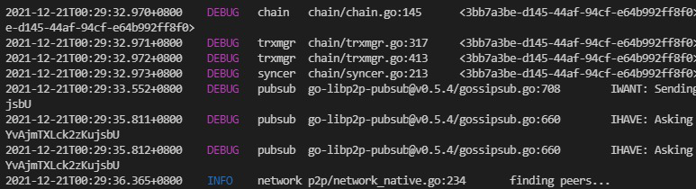

<!--trx_id:f14d4388-3506-45d2-be75-b853ca20aa6d-->

### 2021-12-21 00:32:35

点赞给 `编程自由` 发布的内容。

> DONE：编译 quorum.exe 用最新代码本地起个服务。
> 搞定了。遇到一点麻烦，但都解决了。
> 采用 quorum repo 最新代码，自行编译 quorum binary （要在 ./quorum 主目录下执行 ./scripts/build.sh），添加 bootstrap （要用 命令行启动 quorum.exe 把必要参数传给它；bootstrap 文档的参数要改下）后，http服务就启动成功，可以顺利采用 python requests 来与 api 交互实现各种操作~~

<!--trx_id:f9cf1004-9ac8-46e0-a8c2-5b44a4540dac-->

### 2021-12-21 00:32:47

发布了回复：

DONE：编译 quorum.exe 用最新代码本地起个服务。
搞定了。遇到一点麻烦，但都解决了。
采用 quorum repo 最新代码，自行编译 quorum binary （要在 ./quorum 主目录下执行 ./scripts/build.sh），添加 bootstrap （要用 命令行启动 quorum.exe 把必要参数传给它；bootstrap 文档的参数要改下）后，http服务就启动成功，可以顺利采用 python requests 来与 api 交互实现各种操作~~

回复给 `编程自由` 所发布的内容：

> TODO：编译 quorum.exe 用最新代码本地起个服务。

<!--trx_id:0f6bf4e2-3a0c-43c5-8a24-38b3c64c465d-->

### 2021-12-21 00:33:23

点赞给 `编程自由` 发布的内容。

> TODO：编译 quorum.exe 用最新代码本地起个服务。

<!--trx_id:0fbc5228-7a15-4b25-9deb-ad930996db2b-->

### 2021-12-21 10:57:53

点赞给 `文锋` 发布的内容。

> 原来你是一个程序员小姐姐啊

<!--trx_id:00ac17c0-b209-49c0-8fc4-b0270bea40b6-->

### 2021-12-21 12:20:49

发布了回复：

{
  "genesis_block": {
    "BlockId": "7f9f6c41-72bc-4556-b1d8-7c3a567d582b",
    "GroupId": "101f9dd4-e8eb-4f15-a37d-487b37150125",
    "ProducerPubKey": "CAISIQLb2iHRwdp/CpfbMHcq50KNqpefowhMJO+zGgcmbgJRPQ==",
    "Hash": "OyuoYN4a0oxZHjZkunBkBtRBJ75KsOZKLAq/Xlousi4=",
    "Signature": "MEYCIQCpciOHA+QB4yh4QJ44fOzH/DXo9Agz/dgmayzmCUnlVwIhANKTE4wGz7WNSPe/HN2rWyObnTGWwmXGsr88n+a9XyKO",
    "TimeStamp": "1639996557100485200"
  },
  "group_id": "101f9dd4-e8eb-4f15-a37d-487b37150125",
  "group_name": "testagain",
  "owner_pubkey": "CAISIQLb2iHRwdp/CpfbMHcq50KNqpefowhMJO+zGgcmbgJRPQ==",
  "consensus_type": "poa",
  "encryption_type": "public",
  "cipher_key": "10b730f9ce6f6d578db093ce586750a4b45db70f39f33db898096c621c025ed3",
  "app_key": "group_timeline",
  "signature": "3046022100d4cdf31f74387d8d15c131c651b58b1675c110ec7522ad9303e28853cdda4081022100d3fc7d51ab7272abd9a9829a64b441da85751ccd762127fbe5497c6120e00f09"
}

回复给 `编程自由` 所发布的内容：

> DONE：编译 quorum.exe 用最新代码本地起个服务。
> 搞定了。遇到一点麻烦，但都解决了。
> 采用 quorum repo 最新代码，自行编译 quorum binary （要在 ./quorum 主目录下执行 ./scripts/build.sh），添加 bootstrap （要用 命令行启动 quorum.exe 把必要参数传给它；bootstrap 文档的参数要改下）后，http服务就启动成功，可以顺利采用 python requests 来与 api 交互实现各种操作~~

<!--trx_id:a676a422-b324-44bd-a4c7-56bb1c16bee6-->

### 2021-12-21 12:26:22

发布了内容：

既然英语、中文、德语之类的可以两两互相翻译，我想知道，python，JavaScript，Golang等语言之间是否有翻译工具？
<!--trx_id:f77e5c28-601f-434b-890c-7c87ff50721b-->

### 2021-12-21 18:51:30

发布了内容：

我以前总觉得任何一门编程语言，单单入门时部署环境就能劝退很多人，所以，xue 的亮点：无需部署在线就用是个不错的卖点。
然而语言学会了就得用。在合适的时机，还是要掌握部署、依赖、环境变量这些概念/操作技能/耐心/灵活/应变。

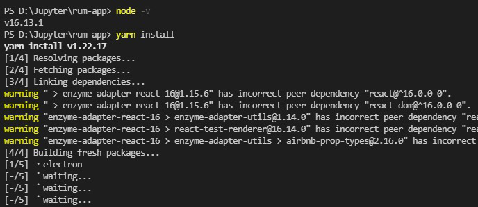

<!--trx_id:1cdcd926-619c-42cc-98b8-0dcb0f3d8977-->

### 2021-12-21 18:58:30

发布了内容：

虽然没有系统去学 go 和 js 的语法，但其实就算只熟悉 python，去看其它语言的 5 分钟/10分钟快速入门，也确实容易很多。
对编程语言的去魅（不畏惧，不露怯），不来自于对python的熟练掌握（但也是基础），也不来自于具体实战后的抽象化、模块化等思维的入髓（但也很必要），而是来自于一个简单到不可思议的视角：用“语言”去看待每一种编程语言，然后会发现除了语法规则略有不同，其背后的设计思想、算法、数据结构这些东西吧。。还蛮相似的。不同编程语言之间的区别，肯定要远远小于一种人类语言与另一种的区别。
这个视角，其实不来自我自己的悟性。而是来自于听古老的 SICP 课程：用 lisp 讲解计算机程序的构造与解释。
<!--trx_id:b29ccbf3-333f-4750-8a43-0ab0a4406add-->

### 2021-12-22 16:45:53

发布了内容：

https://zombit.info/comprehensively-sort-out-the-organizational-structure-of-the-game-guild/
<!--trx_id:5241af44-dc88-40ac-aa71-e292a5c5229d-->

### 2021-12-22 18:57:04

发布了回复：

#检查所有的trx是否都在 blocks 里

#所有的trxs
group_id = "21cdd275-54f7-4c27-8670-cfe855f6261d"
api = f"{url}/group/{group_id}/content"
trxs = {i["TrxId"]:{"times":0,"block_id":""} for i in session.get(api).json()}

groups = session.get(f"{url}/groups").json()["groups"]
#找到对应的组，和最高 block_id
for g in groups:
    if g["group_id"] == group_id:
        block_id = g["highest_block_id"]
        break
print(block_id)     
while True:
    r = session.get(f"{url}/block/{group_id}/{block_id}").json()
    if "Trxs" in r:
        for trx in [x["TrxId"] for x in r["Trxs"]]:
            if trx in trxs:
                trxs[trx]["times"] += 1
                trxs[trx]["block_id"] = block_id
            else:
                trxs[trx] = {"times":-10,"block_id":block_id}
        block_id = r["PrevBlockId"]
    else:
        break

回复给 `编程自由` 所发布的内容：

> 虽然没有系统去学 go 和 js 的语法，但其实就算只熟悉 python，去看其它语言的 5 分钟/10分钟快速入门，也确实容易很多。
> 对编程语言的去魅（不畏惧，不露怯），不来自于对python的熟练掌握（但也是基础），也不来自于具体实战后的抽象化、模块化等思维的入髓（但也很必要），而是来自于一个简单到不可思议的视角：用“语言”去看待每一种编程语言，然后会发现除了语法规则略有不同，其背后的设计思想、算法、数据结构这些东西吧。。还蛮相似的。不同编程语言之间的区别，肯定要远远小于一种人类语言与另一种的区别。
> 这个视角，其实不来自我自己的悟性。而是来自于听古老的 SICP 课程：用 lisp 讲解计算机程序的构造与解释。

<!--trx_id:3a65acb6-f208-4197-8681-21606761af04-->

### 2021-12-23 16:50:11

发布了内容：

TODO：写个基于 rum 网络的爬虫：搜寻有哪些公开的种子网络，然后主动加入。
<!--trx_id:7b608dc6-85b6-4615-a661-e2aedb0e5dbf-->

### 2021-12-23 16:50:54

发布了内容：

TODO：RUM 的发布内容的api，其中那个字节流是否可以用来传输文件？试试玩一下。
<!--trx_id:5210eaec-a645-4ce7-9ce1-f5e23b3b38be-->

### 2021-12-23 16:51:22

发布了内容：

TODO：如何把 content 的字节流还原为图片？实现一下。
<!--trx_id:536acc8c-4852-469c-93fa-500ae059a854-->

### 2021-12-23 16:51:53

发布了内容：

TODO：待办清单的 group 类型，觉得可行，想玩玩看。
<!--trx_id:cbe2c471-c26c-4af0-997c-c32313b78cab-->

### 2021-12-23 16:52:29

发布了内容：

TODO：昨天用到的 block/trx的分叉检测相关的逻辑，可以封装下，以后有机会多次用到。
<!--trx_id:7775b88b-79da-42f8-a69b-04e8c73d6204-->

### 2021-12-23 16:53:26

发布了内容：

TODO：试着把微博搬运bot部署在云。
<!--trx_id:86e5131a-8522-47dc-9d79-da4dc160b67b-->

### 2021-12-23 16:54:57

发布了内容：

TODO：新开一个group，专门搬运价格。试着把价格数据转换为本地数据，并用 pandas/matlib绘图？也许没必要。先放着吧，什么时候特别想玩的时候再试试看。本能觉得没啥难度，但耗时间。
<!--trx_id:93f67039-0f88-425a-82ba-140a8d2d4ff3-->

### 2021-12-23 16:56:08

发布了内容：

TODO：用 quorum + jupyter/python requests 试试一台设备多开。其实已经验证这可以办到，但还要具体尝试下。甚至可以把相关参数部署到一个脚本中来玩切换。哈哈哈。
<!--trx_id:3f1114f8-a965-4ca7-a4cd-bb2d6b5efaff-->

### 2021-12-23 16:57:39

发布了内容：

#今天的新鲜感#

<!--trx_id:501d0244-3d2b-4433-b5d2-c50299ed23f2-->

### 2021-12-23 18:21:54

点赞给 `编程自由` 发布的内容。

> TODO：如何把 content 的字节流还原为图片？实现一下。

<!--trx_id:7aae6335-ba65-4431-a42f-8d31191434c2-->

### 2021-12-23 18:21:59

发布了回复：

搞定。

回复给 `编程自由` 所发布的内容：

> TODO：如何把 content 的字节流还原为图片？实现一下。

<!--trx_id:bc70273b-ef52-4f70-b4f3-9e773c914c97-->

### 2021-12-23 18:22:19

发布了内容：

DONE：如何把 content 的字节流还原为图片？实现一下。
还真是简单啊。。

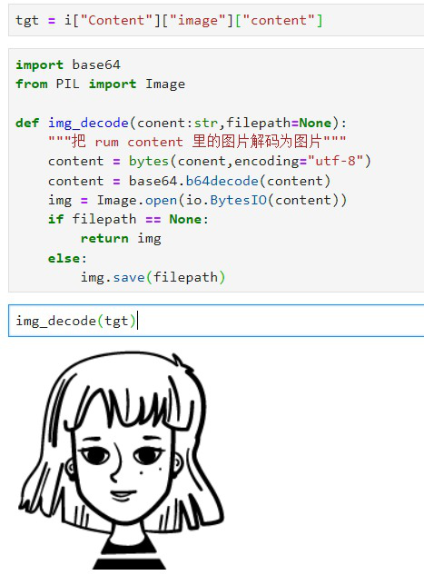

<!--trx_id:1bd0736e-f06b-4ea7-bb5f-aa5b0bb896b6-->

### 2021-12-23 18:35:18

点赞给 `编程自由` 发布的内容。

> TODO：RUM 的发布内容的api，其中那个字节流是否可以用来传输文件？试试玩一下。

<!--trx_id:a4b80ee4-738d-471d-929e-7314edcba720-->

### 2021-12-23 18:38:11

发布了内容：

DONE：RUM 的发布内容的api，其中那个字节流是否可以用来传输文件？试试玩一下。

不行，type目前就是支持 Note 和 image，这个用来约定数据类型，方便解码。那还是底层拓展的事儿。=。= 我可真贪玩。
<!--trx_id:f7c15e47-6812-42ab-afa6-5a461cb13b70-->

### 2021-12-23 20:57:24

发布了内容：

DONE：昨天用到的 block/trx的分叉检测相关的逻辑，可以封装下，以后有机会多次用到。

代码封装其实容易。毕竟探索的路，昨天都走完了。今天只是封装到 Rum 类而已。

https://github.com/liujuanjuan1984/common_python_code/commit/4ba5eae75cf15df815d34ffb0f569c917145ccf4

只是这个方法运行后检测的结果如何进一步确认/排查，需要继续深究了。
<!--trx_id:7d9aa13b-1d62-47af-9a23-33f7221e2c4c-->

### 2021-12-23 20:57:38

点赞给 `编程自由` 发布的内容。

> TODO：昨天用到的 block/trx的分叉检测相关的逻辑，可以封装下，以后有机会多次用到。

<!--trx_id:48cf6005-4412-403e-8abc-b7ed4abcf589-->

### 2021-12-23 21:01:56

发布了内容：

待办清单的 group 类型，我是这样设想的：
- Like/Dislike 数据，可以用来处理成 完成/取消完成，视觉从小手换成复选框/选中效果就行。
- 每推送一条post就是一条待办。评论/回复该条 post 就是 子任务，也能处理待办。

数据逻辑上完全走得通。只是视觉渲染不同而已。很想尝试。我自己都走通的话，开发者还有哪些路径会遇到困惑，也能比较好地完善了。。
<!--trx_id:64ba0e61-968b-40e9-b076-46f7f7d5dde0-->

### 2021-12-23 21:04:23

发布了内容：

DONE：昨天用到的 block/trx的分叉检测相关的逻辑，可以封装下，以后有机会多次用到。

代码封装其实容易。毕竟探索的路，昨天都走完了。今天只是封装到 Rum 类而已。

https://github.com/liujuanjuan1984/common_python_code/commit/4ba5eae75cf15df815d34ffb0f569c917145ccf4

只是这个方法运行后检测的结果如何进一步确认/排查，需要继续深究了。
<!--trx_id:d2326ddb-4ab9-41e2-beca-039dbac00fb3-->

### 2021-12-25 11:11:07

发布了内容：

TODO：group to share seed auto.
<!--trx_id:e3edc03b-004f-4634-893c-8a62cad28d66-->

### 2021-12-25 11:17:07

发布了内容：

TODO： join group 的 status code 验证
<!--trx_id:227a9b8d-ba8f-4123-8fce-40bdb4f94f37-->

### 2021-12-25 11:17:35

发布了内容：

TODO：运行新分装的 trxs/blocks check后，深究下运行结果。
<!--trx_id:de9eb514-644c-4e8d-a12c-a759dd1a6da5-->

### 2021-12-25 11:41:14

发布了内容：

TODO：在云服务器部署自动加入用户分享的种子网络的脚本，全天候运行。
<!--trx_id:90fd56c6-fb7c-4131-89ad-fe0cb0694e0f-->

### 2021-12-25 11:58:21

发布了内容：

DONE：写个基于 rum 网络的爬虫：搜寻有哪些公开的种子网络，然后主动加入。

Rum加了2个新方法：
- scrawler_group_seeds，传入group_id，得到这个group里分享的 seeds。
- scrawler_seeds_to_join，从当前 node 已加入的所有 groups 爬取种子并加入。
<!--trx_id:0806efbd-1c37-48d0-9758-8b1f59bb8299-->

### 2021-12-25 12:16:32

发布了内容：

TODO：把 group 封装为一个新的类。
<!--trx_id:4edf4ace-ec70-45bf-9c55-d16994663935-->

### 2021-12-25 15:13:26

发布了内容：

最近有个新乐子，当头脑空着（比如走路，吃饭，做家务，入睡）时，就戴着耳机听AI读《三体》。
听的是，罗辑从冬眠中醒来，人类社会转入地下居住，发达/自信，第一颗水滴来了，人类本以为是三体人讲和，结果所有宇宙战舰毁灭，仅有两拨力量逃出，而这两拨又经历黑暗时代，互相残杀。
太戏剧性了，尤其是水滴对人类的降维攻击，与之前的自信形成强烈的对比，一度听到我全身发颤，双目流泪。
<!--trx_id:f858bc96-9944-41cb-9fef-4643d2a692f4-->

### 2021-12-25 15:59:48

发布了内容：

DONE：ipynb与md的互相转换，代码最好拆成独立的，不依赖其它自定义类。

互相转换倒是简单。不过没拆分单独的代码。
ipynb to markdown：JsonFile.output_md
<!--trx_id:21b155d6-8c9d-41b0-94d0-fd55bf03df0e-->

### 2021-12-25 16:00:03

点赞给 `编程自由` 发布的内容。

> TODO：ipynb与md的互相转换，代码最好拆成独立的，不依赖其它自定义类。

<!--trx_id:c764894d-fbad-446a-b184-8f95ddff8d67-->

### 2021-12-25 16:20:51

发布了内容：

DONE:  发个requests基础用法文章。

文章是现成的。只是编程笔记适合用ipynb来撰写和保存。
想要发布，要把ipynb自动转换为 markdown 文件。
转换后，人工稍微校对下，就可以发布了。

https://mp.weixin.qq.com/s/_uXOk3A_S7zvZLKPdgbsxg
<!--trx_id:40178e41-b28e-4045-ae5a-b641ee205c7b-->

### 2021-12-25 16:21:04

点赞给 `编程自由` 发布的内容。

> TODO: 发个requests基础用法文章。

<!--trx_id:575ff624-09d5-43f9-a969-777f6d097651-->

### 2021-12-25 16:27:42

发布了内容：

TODO/DONE 这个句式，我用的越频繁，越想要把它产品化。。
<!--trx_id:c492deeb-a563-4b80-9db2-cdac40f4f378-->

### 2021-12-25 16:39:30

发布了内容：

我昨天还在和老公解释：为啥我在玩代码，这算不算玩物丧志？
我说，在成熟的行业，比如网游研发，写代码的人就约等于工具人。但在新兴领域则不是，它需要大量的产品试验，频繁地 demo。
放到 RUM 上来说，我看到它的核心竞争力，是 RUM 的底层，它的网络/存储 已经实现了彻底的分布式，基于此它还有 区块链/智能合约/共识/NFT 这些设计与实现。这些是最难的部分，是很多项目都逃避实现的部分。
这些都是积木方块。对它的理解/发展/演变，我不想停留在转述人的角色，我想要提高自身对于RUM能做什么/不能做什么的判断力/预见力，我希望能逐渐发展验证自身想法的 DEMO 开发能力。
如果这个学习成本很高，我自然无法产生这样的想法。但三个月很快，三年也很快，这几年，xue已经让我有足够的动力学习和使用Python，这种实战让我具备了学习或实现更多东西的加速度。。
但这依然属于“玩儿”的范畴，要想让“玩儿”被分配到的时间更充裕，更有底气，我也必然要拿它来产出必要的价值。然后似乎这就是一种正向循环。
我并不是总是在“玩儿”，但当我有精力可以沉浸在“玩儿”中，我真快活。
<!--trx_id:3baf617d-64f8-4f41-8521-783b48cd2233-->

### 2021-12-25 16:47:10

发布了内容：

我观察到人们普遍存在对账号的痴迷。
这是否是中心化互联网环境下的一种必然？
拥有了账号，在任何地方都可以使用该账号来访问那个中心服务器，获取到相应的数据。
本质上我们应该痴迷的是，由自己所生产/交互的数据。由这些数据所形成的信息网络或关系网络。
如果这些数据你本来就已经拥有了，它到底是一个账号产生的，还是N个账号产生的，其实都不重要了，对吗？
就比如我这个朋友圈，我用了很多个账号来发布内容。有时是因为我测试，弄坏了某个老账号。有时是通过多台设备分别访问这里并发布内容。有时就是换了一个新账号而已。
其实我已经掌握了全部数据，我依然可以针对这些数据，筛选或统计出自己想要的一切信息。而不需要依赖于账号本身。
当且仅当账号与资产/钱包/所有权绑定时，账号才具备了一定的价值。
但假如，所有账号都绑定同样的钱包，所有产生的价值转移都往这个钱包转移，那么重要的依然是钱包，而非那些账号。
这个话题我一直在想，是重塑人们对账号的痴迷，还是满足它？又该如何满足？
<!--trx_id:2de7b7a8-56bd-4146-9d53-38e9baa04d8e-->

### 2021-12-25 16:48:18

发布了回复：

这属于我的个人认知，这个认知让我之前在网游行业主动远离技术向职能。

回复给 `文锋` 所发布的内容：

> 网游研发，写代码的人就约等于工具人。。。
> 太现实了

<!--trx_id:e4d8f99d-677d-41b5-965e-9411ecc17188-->

### 2021-12-25 16:52:13

发布了内容：

是否把我在这里发的内容，转发到其它种子网络，是我想过很多次的一个话题。我想其它用户多少也遇到。但人工复制粘贴到多个种子网络，有点接近于某人经常刷屏搬运东西的性质，说实话，有点讨人厌。
我们之前讨论过一种实现，也就是发布内容后，这条内容连带来源（比如来自某某种子网络的超链接，点该种子网络可以访问）如果可以一键转发呢？
一是操作方便，体验好，二是为首次发布的那个种子网络带来流量，三是所属权更加明确，于是利益分配也将相对容易。
未来这种实现（或类似的实现）一定是会有的。均在设计/设想之中，只不过还依赖一点基础设施做完。
<!--trx_id:7b89c022-bcdc-4704-a943-9979ed9dbba8-->

### 2021-12-25 16:52:54

发布了回复：

注意逐字阅读，在成熟行业。。

回复给 `文锋` 所发布的内容：

> 我以为技术是核心。。。看来不一定啊

<!--trx_id:1f844525-cd2f-45aa-aadb-16fdc3ff9668-->

### 2021-12-25 16:56:48

发布了内容：

为什么我说在网游研发这种成熟行业，写代码的人约等于工具人？
这当然是我的观点，而非行业事实。我的这个过往认知，让我不断远离让自己技术向的职能。观点无对错，它只是观点。
我以前总认为，在游戏研发领域，绝大部分写代码的人，所做的事情无非就是在翻译，把策划设计翻译成代码罢了。
<!--trx_id:c8164a8d-5b11-4129-a67d-11ba8e1aa882-->

### 2021-12-25 17:14:22

发布了内容：

TODO：groups的最后更新与trxs的最后更新是否一致？用什么来判断group的最后活跃时间？
<!--trx_id:0f41ca4d-d3f6-45fa-be7c-d8f9cb434d53-->

### 2021-12-25 18:32:48

发布了内容：

DONE：group to share seed auto.

BOT自动爬取并推荐种子，抓取任何公开种子网络分享的种子，但仅有活跃的种子才推荐

{
  "genesis_block": {
    "BlockId": "65b3d55b-73b5-4d13-9550-4d37d53ec7d3",
    "GroupId": "89703dbe-93c6-4be0-ba26-dce563181194",
    "ProducerPubKey": "CAISIQPTrmj7NOYeFFXgxe5dHuEqQ5dEtL5WIvFD5i6jD2He+w==",
    "Hash": "16wubZBYp8jWpYZtAy73WsfeR3vRDADOEqIfrfi74/g=",
    "Signature": "MEUCIQD5UUyFPx2CzFFwCnFLN7gxfV30zQBmjS2jybSUls8yLgIgOvhOJdsGh5wrb0FmG5mGxdChSaINdyTpUZE6JVYE5hI=",
    "TimeStamp": "1640423797361990300"
  },
  "group_id": "89703dbe-93c6-4be0-ba26-dce563181194",
  "group_name": "种子大全",
  "owner_pubkey": "CAISIQPTrmj7NOYeFFXgxe5dHuEqQ5dEtL5WIvFD5i6jD2He+w==",
  "consensus_type": "poa",
  "encryption_type": "public",
  "cipher_key": "c4dbd9726e6dc58830b29c2ba8fc0a5cd8bc66a3d3578e1da30e46445bc03747",
  "app_key": "group_timeline",
  "signature": "30450220427355d125ce8488604c0f2c4b1b7194aa20602f6c83978d6fcb330dcec41b0d022100addc072d09b6602da9c995fb3f97aad1faf0ac4851f8d4fea2519db442c211f1"
}
<!--trx_id:b608220e-51b1-4152-836f-969840ff9f17-->

### 2021-12-25 18:41:35

发布了内容：

TODO：group info trxs update:  trxs in blockchain
<!--trx_id:40c38e34-012b-4d83-b637-c2499c47eae0-->

### 2021-12-25 18:42:06

发布了内容：

TODO：users in trxs vs users joined group?
<!--trx_id:6bc73a94-9221-4089-bb91-0d380873cc4c-->

### 2021-12-25 18:47:22

发布了内容：

TODO：post view-group-info auto  for some groups
<!--trx_id:b12245ee-2f79-4b19-8b38-18efc9e9c166-->

### 2021-12-25 19:37:55

发布了内容：

TODO：update docs of prsdev.club
<!--trx_id:0dcba4ca-6df8-4480-98b8-32caff903164-->

### 2021-12-25 19:57:50

发布了回复：

for xx in range(10):
    seeds_store = "89703dbe-93c6-4be0-ba26-dce563181194" #正式的
    #seeds_store = "d87b93a3-a537-473c-8445-609157f8dab0" #测试用，还不是正式的
    joined = r.groups_id()#已经加入的种子网络
    shared = r.scrawler_group_seeds(seeds_store)#已经分享的种子网络
    for group_id in joined:
        if group_id == seeds_store:#不用检查自己
            continue

        seeds = r.scrawler_group_seeds(group_id)
        for i in seeds:#搜寻更多种子
            if i not in joined:#加入未加入的种子网络
                print(i,"joined?",r.join_group(seeds[i]).status_code)
            if i in shared:#已分享的种子，跳过
                continue
            info = r.view_group_info(i)
            if info["trxs"] <1:#没发布过内容的，跳过
                continue
            if info["first_updated"] <= "2021-10-01":#太早的种子，跳过
                continue
            if info["last_updated"] <= "2021-12-18":#多日无活跃的，跳过
                continue

            infostr = f"\n创建 {info['first_updated']}\n最新 {info['last_updated']}\nTrxs>={info['trxs']} 条 活跃>={len(info['users'])} 人"

            data = {
                "type": "Add",
                "object": {
                    "type": "Note",
                    "content": str(seeds[i]).replace("'",'"')+infostr,
                    "name": ""
                },
                "target": {
                    "id": seeds_store,
                    "type": "Group"
                }
            }
            sc = r.post_content(data).status_code
            if sc == 200:
                shared[i] = seeds[i]
            if sc != 200:
                print(i,r.post_content(data).json())
    print(xx,"一轮完成")
    sleep(60*30)

回复给 `编程自由` 所发布的内容：

> TODO：在云服务器部署自动加入用户分享的种子网络的脚本，全天候运行。

<!--trx_id:1cf2a0e1-aafc-401a-b86a-0e6e36a21ff9-->

### 2021-12-25 20:36:36

点赞给 `编程自由` 发布的内容。

> TODO：在云服务器部署自动加入用户分享的种子网络的脚本，全天候运行。

<!--trx_id:fc7964ba-c08f-45cb-b6c1-e81f1c858eda-->

### 2021-12-25 20:37:06

发布了内容：

DONE：在云服务器部署自动加入用户分享的种子网络的脚本，全天候运行。

只部署了一台，先观察效果看看。另外2~3台以后再部署。
<!--trx_id:9ca573e7-1f6b-466a-a586-e022570ea251-->

### 2021-12-25 21:12:02

发布了内容：

去中心微博
创建 2021-10-20 11:07:24
最新 2021-12-25 20:34:57
Trxs>=9194 条 活跃>=589 人
<!--trx_id:9cdae258-92dc-4856-9610-69756cbacdf1-->

### 2021-12-25 21:12:03

发布了内容：

刘娟娟的朋友圈
创建 2021-11-22 17:40:58
最新 2021-12-25 20:37:06
Trxs>=506 条 活跃>=78 人
<!--trx_id:4295ddc7-fd0e-4f79-b474-75878bb5329a-->

### 2021-12-25 21:21:46

发布了内容：

DONE：post view-group-info auto for some groups
<!--trx_id:d75e41fe-b5e2-4c3d-8fdb-cd3ce353afb6-->

### 2021-12-26 21:16:50

发布了内容：

类，我之前只用过父类/子类这种继承的方式，还从来没有创造过这样的实现代码：一个类的方法将返回另外一个类。想了想 pandas 的 dataframe 就明白，其实这应该是一种常态。
<!--trx_id:e7d2d238-017b-497c-883b-41ec125bfcc5-->

### 2021-12-26 21:26:29

发布了内容：

《三体》告一段落。并没有完整地阅读，主要是在听第二部的第三部分“黑暗森林”部分。这种盲目自信与冷酷现实的巨大落差，叙事上颇具美感。其余部分顺着兴趣多看了些，但终究还是不想花更多时间啦。
<!--trx_id:4b079c3e-f818-445c-b480-d2bbe30da250-->

### 2021-12-27 01:01:02

发布了内容：

刘娟娟的朋友圈
创建 2021-11-22 17:40:58
最新 2021-12-26 21:26:29
Trxs>=517 条 活跃>=80 人
<!--trx_id:54d80e64-ab4b-4acb-a1ee-79a4da452ff2-->

### 2021-12-27 01:12:34

点赞给 `编程自由` 发布的内容。

> TODO：post view-group-info auto  for some groups

<!--trx_id:f0535aa8-f84d-4e32-8a6c-53cb11857be9-->

### 2021-12-27 01:12:45

点赞给 `编程自由` 发布的内容。

> TODO：把 group 封装为一个新的类。

<!--trx_id:61b2df5a-a4f4-4dc5-9ba0-98a766c846fa-->

### 2021-12-27 01:17:37

发布了内容：

DONE：把 group 封装为一个新的类。

Rum.py 被我快速填充了大量方法，越来越庞杂臃肿。终于一鼓作气把 API方法（自定义API类）、建立API交互所需的HTTP连接实例（rumapi，作为后面几个类的参数）、Node类、Group类，以及我在用的经过封装后的任务（Bot）拆分开了。
我稍稍犹豫过，是不是 Node类 或 Group类 应该继承自 API 类，但很快就相通它们有调用关系，但无继承关系。这或许就是面向对象好玩之处吧，Node，Group对象是谁，边界很清晰，只不过在它们取得具体数据时，需要有 rumapi 连接实例来获取数据。
<!--trx_id:ad162093-a1d6-4f0c-9bc3-b96e93bf826d-->

### 2021-12-27 01:17:51

点赞给 `编程自由` 发布的内容。

> TODO：group to share seed auto.

<!--trx_id:f49de7b2-9dee-447d-87e5-8ef9baabcade-->

### 2021-12-27 01:18:33

发布了内容：

TODO：pygame作为壳儿来与quorum交互呢？
<!--trx_id:46afb2eb-7849-42d4-b5c9-e9dfbcba9459-->

### 2021-12-27 01:18:50

点赞给 `编程自由` 发布的内容。

> TODO：写个基于 rum 网络的爬虫：搜寻有哪些公开的种子网络，然后主动加入。

<!--trx_id:69d8dbda-2fa9-443f-b4e3-5130e18c675e-->

### 2021-12-27 01:21:33

发布了内容：

TODO：更接近闪念胶囊，利于沉浸式收集闪念碎片的壳儿呢？
<!--trx_id:2e8a0d06-d78a-4377-a961-b2b5b04dec55-->

### 2021-12-27 09:41:32

发布了内容：

TODO: firt seed of new users
<!--trx_id:a9abfd69-a2da-4280-adcb-a582e07f2efe-->

### 2021-12-27 09:42:39

发布了内容：

TODO:  path in swag_init.sh
<!--trx_id:981f0921-4db1-425f-a690-9c64d22ecf84-->

### 2021-12-27 09:43:12

发布了内容：

TODO: repos 同步（origin，upstream）策略
<!--trx_id:3c20c7ab-0444-4939-b5e9-7c2aef362412-->

### 2021-12-27 09:43:24

发布了内容：

TODO：分页API怎么用的？
<!--trx_id:5999232d-eef8-474f-98a1-5c023724d1fd-->

### 2021-12-27 10:11:40

发布了内容：

DONE: first seed for new users

具体产品建议已经提交了。等时机合适时再看看要不要做吧。
<!--trx_id:5f99dd4a-b8af-46b2-8532-3b8296b329d0-->

### 2021-12-27 10:11:52

点赞给 `编程自由` 发布的内容。

> TODO: firt seed of new users

<!--trx_id:26227034-cbb3-4eda-ac66-88f89c28b273-->

### 2021-12-27 10:11:56

发布了回复：

DONE: first seed for new users

具体产品建议已经提交了。等时机合适时再看看要不要做吧。

回复给 `编程自由` 所发布的内容：

> TODO: firt seed of new users

<!--trx_id:8c0f1197-de96-453c-885c-42d4815a1573-->

### 2021-12-27 12:33:51

发布了内容：

TODO：bbs/timeline post content （data) 的区别。
<!--trx_id:fc6f58a1-66d8-4973-9a9f-4764d79af044-->

### 2021-12-27 12:35:17

发布了内容：

DONE：join group 的 status code 验证

200/400
<!--trx_id:9f484137-0d4d-4fde-8841-09a802f565ea-->

### 2021-12-27 14:53:39

发布了内容：

撞墙了。。我用python封装了几个功能型插件，但我不知道如何让它们可以被更多 rum 用户所低门槛地使用。具体想法有几个，但都不太可行，也从没试过。
只是丢 python 代码出来倒是容易，反正已经放出来在我的 github repo上了。
<!--trx_id:780c9c6b-7f5b-497a-9953-88b5c8cfba13-->

### 2021-12-27 15:20:54

发布了内容：

有个简单的小项目想法：rum 网络浏览器，功能是展示公开的 seeds（种子网络），展示种子网络的 trxs 数量，最后更新数量，活跃用户数量等等统计数值，未来也可以读取种子网络的公告信息等，可以一键拷贝种子，然后自行去 rumapp上加入该种子网络。
<!--trx_id:f8b2a136-874d-4a8b-a2d6-a4e6b6a8a027-->

### 2021-12-27 15:41:26

发布了内容：

DONE：在云服务器部署自动加入用户分享的种子网络的脚本，全天候运行。

部署了第二台云服务器。暂时两台也够了，不部署更多了。
<!--trx_id:8dae3c03-2f46-434d-b7af-2f91dd9a3062-->

### 2021-12-27 15:41:41

点赞给 `编程自由` 发布的内容。

> TODO： join group 的 status code 验证

<!--trx_id:e91bab49-c5c5-49d8-a3a9-3683d43b617f-->

### 2021-12-27 21:23:00

发布了内容：

刘娟娟的朋友圈
创建 2021-11-22 17:40:58
最新 2021-12-27 15:53:40
Trxs>=543 条 活跃>=80 人
<!--trx_id:0409b154-ab23-4cab-92ba-ecfafc4be516-->

### 2021-12-27 21:26:23

发布了内容：

从网上找了一个现成的采用 pygame 实现的 数独游戏 源码，稍微改了下，可以在本地玩，然后通关后，自动把结果推送到 Rum 指定种子网络用以保存数据。
<!--trx_id:e9bb1b86-bd8b-4204-9a86-a332f1cd4bb1-->

### 2021-12-27 21:30:44

发布了内容：

傍晚觉得脑袋撞墙，并且有点沮丧，就外出散步。冷冽的风，真是让人清醒。我所看到的是，Rum 在每个用户的本地有一个服务端 quorum.exe，有一个客户端 rum.exe（GUI)。服务端负责和其它用户建立网络连接并同步数据，也负责与客户端交互。客户端负责把拿到的这些数据按对用户更友好的方式/特定的使用场景展现出来，也根据用户的行为去向网络提交数据。换言之，只要有了本地服务端作为基础，客户端其实有无数种可能，长什么样子似乎都行。
<!--trx_id:35a57417-3b89-4f07-a85b-2ee3e0d2346c-->

### 2021-12-27 21:31:40

发布了内容：

TODO：写文章，数据所有权在自己手上到底有哪些具体实在的好处

散步时想了很多，不过没有语音输入留存。明天要专门写下来。
<!--trx_id:52a62066-16ea-437f-b2ce-a33f4dfd5406-->

### 2021-12-27 21:32:16

发布了内容：

TODO：完全离线情况下，RUM的单机用法？比如API交互这些
<!--trx_id:dd964edc-03f9-4a05-99d6-345ac1abf7ab-->

### 2021-12-27 21:40:28

发布了内容：

刚学python的头一年，曾经花了一天的时间久坐，来尝试实现数独解题。那大概是我用python实现的第一个案例。今晚玩过 数独生成 后，才发现，这里的算法是真难。按网友的说法，即便是 9*9数独，已经是高维度了，已经开始相互纠缠了。
我并没有搞懂或彻悟我所照搬的源码的这处算法。我只是突然意识到了它的精妙。甚至我越来越觉得所搬运的这个算法其实是不优美的，它生成的数独实在是缺少变化。
但算法/高纬，这些并不是我现在的编程成长的焦点所在。
焦点是啥？把自己会写的逻辑封装成应用，让普通人也能直接用啊。。
<!--trx_id:9aa096b0-6db5-4079-bf9d-8377979553ba-->

### 2021-12-28 09:40:32

发布了内容：

早上直接坐到电脑前，和先运动一段时间再坐到电脑前，身心状态是有显著差别的。当然是运动过后再回到电脑前，身心更适合脑力活动。
<!--trx_id:7a5c35c5-ba9a-4b12-bb46-6890e8f0c51c-->

### 2021-12-28 09:53:10

发布了内容：

昨晚陪女儿入睡时，找了一本讲 HTTP 协议的电子书看，看到实在犯困就直接和女儿一起入睡了。这本书很不错。但可惜的是，大部分内容，我自己之前已经做过功课了。比如 TCP/IP协议簇，比如 HTTP 各种请求与反应等。但依然有看的必要，因为它就好像一副完整图，让我印证了拼图拼凑的效果，还修正了某些地方的错误认知。
<!--trx_id:5587b606-f706-4816-aa16-82ea28052cfe-->

### 2021-12-28 11:16:40

发布了内容：

很好玩。只要约定好规则（方便程序按规则筛选TODO，标记是否完成，排除干扰，搜集备忘信息等），现在我可以放心用这个组来管理待办清单了（如果我想的）。

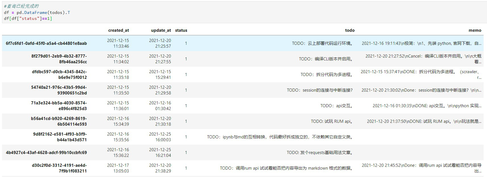

<!--trx_id:15fe4edd-4179-4e95-8e0b-d4b5fb6a6536-->

### 2021-12-28 11:17:30

发布了内容：

我总是说，只要你自己掌握了数据，只要你掌握一点处理数据的基础技能（比如我用python），你就拥有了无限的自由。
<!--trx_id:8c9b712f-8a99-41dc-848f-c266de6f7707-->

### 2021-12-28 11:19:00

发布了内容：

因为我的编程能力，还不会把功能产品化，（主要是让不懂代码的人直接去图形界面去交互使用），所以我无法让你们切实体验到在 RUM实现了让你自己拥有数据主权后，你所拥有的各种自由。。但我自己当下确实深刻感受到了这一点。
<!--trx_id:c86918e5-3ace-4062-9f93-8712a76fcd08-->

### 2021-12-28 11:22:43

发布了内容：

自己本地使用文本编辑器，也能自己掌握数据啊？ 你可能会这样想。对，没错。但RUM更进一步，其一，你可以用多台设备，连入同一个group，并共享这个group的数据。每个设备都是构成了该group的数据备份。而在很多应用中，比如我很喜欢的obisidian中，多台设备同步数据是非常昂贵的付费功能。其二，你可以对内容有非常灵活的打散/组织（把内容发布到不同group，每个group你控制传播范围），就相当于你在互联网/电子设备所看到/生产的所有数据，都能被自己掌握主权。这些是现有的互联网完全无法提供的。
<!--trx_id:caf2fb9d-b01b-4562-8b95-6927a1deb7fb-->

### 2021-12-28 11:25:55

发布了内容：

听霍炬讲某些图景，会令我兴奋。但还不够。他必经太超前，绘制了某些图景，但有些还没有实现，还无法体会。只有当我先是用python requests 实现了与API交互获取数据，然后基于自己的各类数据生产/管理需求，而用python很方便地实现出来后，我才切实体会到了这其中的美妙。妙不可言。
我有动力让更多人也能体会到这种美妙。而不单单是用文字告诉你RUM可以，我更想让人们切实使用到，感受到。
<!--trx_id:defdf8f8-03b8-4bc9-a1a8-2c3b6068394c-->

### 2021-12-28 11:28:58

发布了内容：

我实现了从其它社交网络/内容平台自动搬运内容，自动在RUM发布内容。
<!--trx_id:127dc864-5b4b-4cca-845e-55c6003103fd-->

### 2021-12-28 11:29:40

发布了内容：

我实现了自动检索RUM网络中所分享的种子，并自动加入；并自动统计该种子网络的活跃情况，自动把该种子网络分享给更多人。
<!--trx_id:43d57fd8-4b78-4eb6-b35e-02971f530cbb-->

### 2021-12-28 11:31:20

发布了内容：

自动检索公开种子，并自动加入，在云节点上部署之后，有一个很好的用途：提高这些种子网络的连通性。种子网络中的public节点，会让该种子网络的可用性有显著提高。很多人自己创建了种子网络，但是无法连通，就是因为种子网络中没有 public 节点。我当然知道协议层面，产品层面会针对该现象做出更决定性的迭代，但我的这个自动处理，成本也非常低，总归是一种补充手段。不是吗？
<!--trx_id:f2650a9a-4356-49e6-b9a7-b5f9f17942c1-->

### 2021-12-28 11:33:44

发布了内容：

自动检索所有的公开种子并加入，会让这个节点拥有比较全面的数据，这些数据可以很方便地统计出来，这些数据的集合，又可以作为一个产品的数据来源：展示 RUM 网络目前的活跃种子网络，它可以是一个很简单的网页，只展示这些信息，每天更新1~2次，用户可以在这个网页上下载RUM应用，也可以拷贝种子直接加入。而这个网站就是一个网页，可以设计一些广告收费模式，比如收费优先推荐某些想要推广/获取流量的种子网络。
<!--trx_id:024b5581-0c8f-4d7c-af3d-938c32cf7559-->

### 2021-12-28 11:34:55

发布了内容：

我实现了把节点所加入/所同步到的所有数据，都可以导出（包括图片和文字）为 txt 文件，支持markdown 格式，让图片也可以很好地呈现。
当然也可以指定只导出自己产生的数据。
<!--trx_id:6df8df9a-9d21-41e8-bb58-f652a8416e38-->

### 2021-12-28 11:35:14

发布了内容：

既然数据已经全然掌握了，那么基于数据的统计分析，则易如反掌。
<!--trx_id:452d9f47-1762-49ac-a623-3c7afaed19a8-->

### 2021-12-28 11:37:39

发布了内容：

我还尝试了利用已有的数据类型，约定一个简单的规则，来实现待办清单这样的应用场景。还可以有更多。可以是闪念胶囊，收集你所有的自言自语；也可以是笔记。可以是很多东西。
我看到了一种丰富的可能性，几乎所有的弱联网属性的互联网产品，都有采用RUM再实现一遍的可能性。它只取决于受众是谁，成本如何，收益如何。
<!--trx_id:ba5a9288-fa33-4520-95c0-8575eaf423a3-->

### 2021-12-28 15:12:55

发布了内容：

我最近一直在玩代码，自己当然是很嗨的，但内心一直隐隐不安，担心自己是不是不务正业。今天得到霍炬的肯定，心安多了。哈哈。

<!--trx_id:82f98e81-4ce9-457b-804f-9d68bc704bfb-->

### 2021-12-28 15:36:12

点赞给 `编程自由` 发布的内容。

> TODO：users in trxs vs users joined group?

<!--trx_id:4dc9219a-1295-40c4-b27b-a123034161e1-->

### 2021-12-28 15:36:20

点赞给 `编程自由` 发布的内容。

> TODO：groups的最后更新与trxs的最后更新是否一致？用什么来判断group的最后活跃时间？

<!--trx_id:fdaf1415-da12-4546-8548-7ddaf33146e3-->

### 2021-12-28 15:36:37

点赞给 `编程自由` 发布的内容。

> TODO：待办清单的 group 类型，觉得可行，想玩玩看。

<!--trx_id:63aff472-bc5f-4d3a-9d20-b7a45eab02c8-->

### 2021-12-28 15:52:16

发布了内容：

待办清单的逻辑，在这个组也是完全可运行的。——代码我都写好了，可随意复用到任何组。
只不过我依然单独开个组，以进一步观察特定用途的使用效果~
如果你对某个TODO感兴趣，不妨点赞，因为那可能会让我提高完成的优先级哦~

{
  "genesis_block": {
    "BlockId": "b76fd365-327a-42a7-a763-bfa23f46cc6f",
    "GroupId": "5d53968c-3b48-44c5-953f-0abe0b7ad73d",
    "ProducerPubKey": "CAISIQPlSoPo7GaXJq9iFV+TuSUKsBEyCYRCLO3vpZrb6HiiZA==",
    "Hash": "P8zbjeJqRu/tVth1114GLm3eHPLc20aqa2w4QokYEwY=",
    "Signature": "MEUCIQDlfZBgt9DLY5f9BbXw3QOQJp66diBvlSwkQI8xv6JypwIgLurAifsY/zzw5FPJMThnTfwclCa0PjVH5orfAPKZ4Ew=",
    "TimeStamp": "1640662845435973300"
  },
  "group_id": "5d53968c-3b48-44c5-953f-0abe0b7ad73d",
  "group_name": "待办清单",
  "owner_pubkey": "CAISIQPlSoPo7GaXJq9iFV+TuSUKsBEyCYRCLO3vpZrb6HiiZA==",
  "consensus_type": "poa",
  "encryption_type": "public",
  "cipher_key": "9f8f00dd78b77d7dd3ba56c47ee76d25a0ae6f11daa6c894de4e774c76bcc902",
  "app_key": "group_timeline",
  "signature": "3044022062c5e36d895d7c0e7838b117330bac93967bf1d61bf9a996cf995d294be7482902203c9d9584a6be0e2ad65f3c8bf78c7431352582a706fd4bf93f4bf4de2fbe18b0"
}
<!--trx_id:0614c785-9aba-4054-86e7-63f02c351d15-->

### 2021-12-28 16:31:01

发布了内容：

一个想法。

持续xx天达成某个特定目标，场景非常多，比如100天4级词汇包过，21天Python入门，100天连续写作等等。
每天自动生成一条待办任务，然后你要提交相应的数据，比如写作文本来证明你做到了/或没做到。
到期后，你或许还想继续使用，也或许想要结束，把所有数据导出备份。

我设想这种内容可以被定制为一个独立运行的安装包，它和现在的rumapp几乎一样，但不同的是，你下载安装它的动力是，你要完成那个特定目标。
启动节点后，该客户端会自动为你生成一个新的group，并从你设定的日期开始，每天推送一条当天任务。或者自动请求提供该服务的云节点为你创建组、自动生成每日任务。
而你要做，是每天在那条任务的评论区提交数据。

这个过程，你可以完全是私人的。你也可以把它分享给别人，让别人参与进来（同时进行练习，或对你的练习情况予以监督、互动）。

既然它和rumapp几乎一样，如果你愿意，也可以加入更多组，发现rum的更多用途。

你可以随时或到期申请一键导出，把每日任务以及你所提交的数据导出为 pdf 或 markdown 格式的数据文件/压缩包。
导出时，默认只导出你的行为数据，也可以指定多个pubkey（比如，你可能同时用几台设备来访问该group参与练习），甚至导出全部数据：尤其是你想保存亲友与你的互动数据）。

导出是你掌握数据主权的一种证明。也方便你想要去别的地方发布/分享。
当然，你也完全可以继续用RUM，任何时候，你都可以把某个group的seed分享出去，告诉别人你某年某月完成了这个练习。

如果这个想法可以产品化，那么你会发现，有内容的人（比如设计了xx天实现xx的详尽攻略），有计划的人（想要实现连续100天写作）的人，都可以被特定目标吸引到使用RUM。
<!--trx_id:8473a32f-3972-4ec8-aae9-aedcd58094c9-->

### 2021-12-28 16:52:01

发布了内容：

black 在格式化这句 python 代码 str(seed).replace("'",'\"') 时，把 \ 符号去掉了。这是 bug 啊！
<!--trx_id:de804a09-b1d3-4994-970d-b6531a0105ec-->

### 2021-12-28 21:24:07

发布了内容：

【刘娟娟的朋友圈】数据概况
创建 2021-11-22 17:40:58
最新 2021-12-28 18:21:15
Trxs>=603 条 活跃>=80 人
<!--trx_id:479799e0-2ab7-43a0-afc9-9324a92ad1da-->

### 2021-12-28 21:25:58

点赞给 `编程自由` 发布的内容。

> 【刘娟娟的朋友圈】数据概况
> 创建 2021-11-22 17:40:58
> 最新 2021-12-28 18:21:15
> Trxs>=603 条 活跃>=80 人

<!--trx_id:9da0b43f-1ef5-478b-8339-db88238bbe25-->

### 2021-12-29 17:19:23

发布了回复：

{
  "genesis_block": {
    "BlockId": "cdb16521-ea0c-4d4b-b14c-e3df10b8acf3",
    "GroupId": "6d601c63-6b4d-4f1e-82ac-52d4e24d8a32",
    "ProducerPubKey": "CAISIQI0l/Q5wP0tYy55qqrYdHuRAHxoLl8TqR68f7oTCjNLvA==",
    "Hash": "gN+GbDAORB7QjSQHCC0hudpGsdbGCG04nBkg990Jw3g=",
    "Signature": "MEYCIQC9r0A5qvXLtT4ld6zaLFNLb1fbc2CcI0OiuZo92ovm/QIhAMvCe020NgyGbh4LCA9c1qEzHfgJ+8ctrkVAThcL/iB7",
    "TimeStamp": "1640763065868288300"
  },
  "group_id": "6d601c63-6b4d-4f1e-82ac-52d4e24d8a32",
  "group_name": "自学者创作、作品社交社区",
  "owner_pubkey": "CAISIQI0l/Q5wP0tYy55qqrYdHuRAHxoLl8TqR68f7oTCjNLvA==",
  "consensus_type": "poa",
  "encryption_type": "public",
  "cipher_key": "bcf19834dc46a062901e9135236e854b9067634ce83479822ed0b5564d7e1364",
  "app_key": "group_post",
  "signature": "30440220594dac8b40e1532087e4be19859400b2e1cf0ba049e1a7e026dc3e21452cd150022002dd9389814b00ac0c4a496394b8d2b29aeb2c79c94b3800afe8d54bcbd0e12a"
}

回复给 `编程自由` 所发布的内容：

> 【刘娟娟的朋友圈】数据概况
> 创建 2021-11-22 17:40:58
> 最新 2021-12-28 18:21:15
> Trxs>=603 条 活跃>=80 人

<!--trx_id:b123e656-18c3-4ea4-88db-307f5edff04c-->

### 2021-12-29 17:37:50

发布了内容：

“一步到位是自我劝退的捷径”，今天我讲出的金句。啧啧，棒极了！
<!--trx_id:860af712-0601-4a1b-9ff0-115167f6c7f0-->

### 2021-12-29 17:43:33

发布了内容：

一口气坐了3小时，这就是我了，喝水/上厕所/起身一下都没有。。。如果不是非常刻意地去运动，久坐的现象很常见。
<!--trx_id:a806ba8b-5445-44ff-841d-1ea80b26a98d-->

### 2021-12-30 10:38:29

发布了内容：

【刘娟娟的朋友圈】数据概况
创建 2021-11-22 17:40:58
最新 2021-12-30 08:41:00
Trxs>=621 条 活跃>=83 人
<!--trx_id:25ba2059-cab4-4fdc-971e-e385c9be39cd-->

### 2021-12-30 12:32:16

发布了内容：

我还是决定放弃“任务计划程序”这个上古玩意儿。写了点代码，把很多个长期间歇性执行任务放在一起一个脚本内顺序进行。
这些任务，有的每天执行一次，有的每小时执行一次，有的10分钟执行一次。如何判断是否应该执行，倒也是很简单。

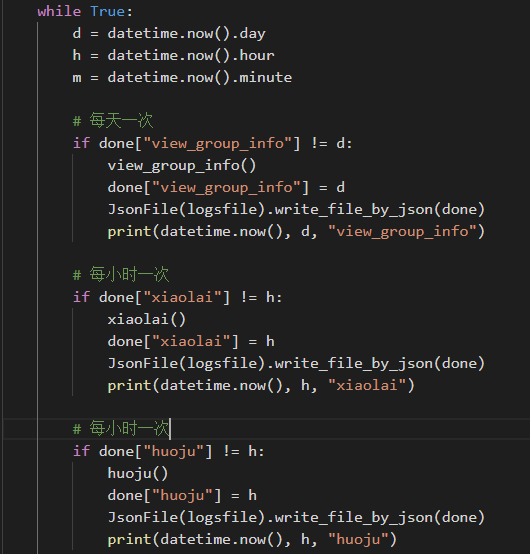

<!--trx_id:0fef6760-fd2c-487e-bc6f-e1180f78f230-->

### 2021-12-30 15:09:24

发布了内容：

中午晒着太阳听着课快走去买咖啡时，突然冒出了一个念头。如果我活到80岁，如果我要在几件事上保证 10000 小时投入，我到底可以有几个选择？
<!--trx_id:0381a3e2-cbf9-4a6e-80f4-20818897a689-->

### 2021-12-30 15:58:10

点赞给 `哇噜噜` 发布的内容。

> 高高兴兴的走来...

<!--trx_id:6ea9574c-75a4-4559-b88d-4808def258bc-->

### 2021-12-30 15:58:17

发布了回复：

环境真好

回复给 `哇噜噜` 所发布的内容：

> 高高兴兴的走来...

<!--trx_id:5d3addef-c522-49b3-af08-36cfe40e5173-->

### 2021-12-30 16:01:14

发布了内容：

距离 2022 年元旦 2022-01-01 00:00:00
还剩 31 小时 58 分钟
<!--trx_id:ccf3c4f5-bd29-4d84-af36-4fc4f23732f5-->

### 2021-12-30 16:03:23

点赞给 `jk` 发布的内容。

> 说到喝水我有个很偷懒的习惯：买了超大容量的水杯，绝对够喝一天那种；或者放一打矿泉水桌下，渴了，顺手即取

<!--trx_id:0115af70-16ee-49eb-a8ad-fff73170807b-->

### 2021-12-30 16:03:25

点赞给 `小牛` 发布的内容。

> 我也是久坐成习惯，后来发现多喝水就能很好的解决这个问题。。。首先会上厕所，其次需要接水，然后循环往复。。。好像喝水很充足的时候，1个小时不喝水，就会觉得口渴，然后不需要刻意接水。

<!--trx_id:b47117a2-bc57-43f4-8663-b73ed30b34cb-->

### 2021-12-30 16:13:43

发布了回复：

哈哈，我是用代码实现的。指定一个终止日期，然后每10分钟，随机选择1~2个组，发布倒计时信息。当然也可以给自己设定倒计时，专门发给自己。

回复给 `jk` 所发布的内容：

> 奇怪，我对时间怎么没有什么感觉呢，就是节假日之类，甚至自己的生日都是过了好几天之后才反应过来，经常是家人提起

<!--trx_id:8ef3e620-ef90-475a-b1c1-70093833191e-->

### 2021-12-30 17:16:10

发布了回复：

这些数据是透明的，本地开着 Rum APP 后，直接读取 API 就调出所有数据，然后自己统计下就行了。
看这个攻略：https://zuopin.xin/posts/7dcd69f32012db4189f8c70027d024f57e2611f870a2e9c6a0a9a729d48f3a1a

回复给 `jk` 所发布的内容：

> 哪里可以看到这些数据呢🤨

<!--trx_id:b51a7976-79af-4791-9277-e697ee64623d-->

### 2021-12-31 09:23:59

发布了内容：

2021 年的最后 3 个月，我交出一份健身打卡成绩单。健身营是个好地方~定投人生课堂的人，都可以加入。
运营组直接为 2022 年开了全年打卡，不知道 2022 年最后一天，我的成绩单将是如何？

<!--trx_id:432376e5-8bfc-4ee6-a2bd-0ce7084ee985-->

### 2021-12-31 10:19:26

发布了内容：

今天我们提前半天放假~
可是我咋觉得自己每天都在放假呢？
因为我做的事情，是自己喜欢的？
因为我对自己做什么拥有选择权？
因为探索出来的东西，又很好运地命中正确的思路？
<!--trx_id:2282b482-004d-4313-9cdb-f71faeedfc03-->

### 2021-12-31 11:00:58

发布了内容：

【刘娟娟的朋友圈】数据概况
创建 2021-11-22 17:40:58
最新 2021-12-31 10:57:47
Trxs>=664 条 活跃>=85 人
Trxs 详情:
- 用户信息 134 条
- 发布内容 238 条
- 评论回复 113 条
- 点赞或踩 179 条
- 其它 0 条
<!--trx_id:0cb4e6a5-97a8-4878-ac83-a6bdedd83618-->

### 2021-12-31 19:21:43

发布了内容：

距离 2022 年元旦 2022-01-01 00:00:00
还剩 4 时 38 分
<!--trx_id:ec345e8a-fdef-4819-993d-2f217712bfed-->

### 2021-12-31 19:22:13

点赞给 `编程自由` 发布的内容。

> 距离 2022 年元旦 2022-01-01 00:00:00
> 还剩 4 时 38 分

<!--trx_id:7c9683e7-adc2-4224-a750-26d4c4aed9be-->

### 2021-12-31 19:22:18

点赞给 `编程自由` 发布的内容。

> 【刘娟娟的朋友圈】数据概况
> 创建 2021-11-22 17:40:58
> 最新 2021-12-31 10:57:47
> Trxs>=664 条 活跃>=85 人
> Trxs 详情:
> - 用户信息 134 条
> - 发布内容 238 条
> - 评论回复 113 条
> - 点赞或踩 179 条
> - 其它 0 条

<!--trx_id:4e0fffc0-16ec-4714-b8a8-3030cf5f1420-->

### 2021-12-31 19:34:26

发布了内容：

距离 2022 年元旦 2022-01-01 00:00:00
还剩 4 时 25 分
<!--trx_id:ed540fb7-d59c-407f-913b-205d4a1fada5-->

### 2022-01-01 08:34:44

发布了内容：

【刘娟娟的朋友圈】数据概况
创建 2021-11-22 17:40:58
最新 2021-12-31 19:34:26
Trxs>=674 条 活跃>=85 人
Trxs 详情:
- 用户信息 136 条
- 发布内容 241 条
- 评论回复 113 条
- 点赞或踩 184 条
- 其它 0 条
<!--trx_id:e5ca9229-4856-4094-9220-e0f2ec913940-->

### 2022-01-02 09:01:22

发布了内容：

【刘娟娟的朋友圈】数据概况
创建 2021-11-22 17:40:58
最新 2022-01-01 08:34:44
Trxs>=675 条 活跃>=85 人
Trxs 详情:
- 用户信息 136 条
- 发布内容 242 条
- 评论回复 113 条
- 点赞或踩 184 条
- 其它 0 条
<!--trx_id:943f0a6a-af1b-4b0d-a3a0-3878574badd3-->

### 2022-01-04 13:04:50

发布了内容：

Rum的 group chain ，其实就是一种分布式数据库。最近的 idea 探索，想往这方面试试看。一些复杂点的逻辑，所有数据的增删改都往 group chain 上写。而交互，则在另外的界面进行。
<!--trx_id:c91b36d2-5120-4dff-8f78-34a7447c0d3e-->

### 2022-01-04 14:37:17

发布了内容：

上一条提到的想法，基本上验证OK了。
新加入的人，初始化生成一个wallet。（截图为很多操作后被反复更新后的 wallet）
通过某些任务获得某些积分，比如这个案例展示的是完成不同待办清单，获得 points、阳光、水、肥等。
支付 points 购买土地、种子。
当阳光、水、肥充足时，可以把种子种到土地上。
时间足够时，就会收获奖励（coupon）。
用 group chain 保管的，仅仅有 wallet 的任何增、改操作。
这个场景可以拿来给娃或自己设定阶段目标，奖励点数，收集点数可以获得一些奖励券（coffee-mini 可以去兑换小杯咖啡）
验证完，把它 GUI 化的想法还是挺强烈的。不过也验证了一个猜测，任何数据的增改，间隔频次只要不太频繁，性能完全OK。毕竟每个 trx 出块都是需要至少数秒时间。

<!--trx_id:ee0df2a1-e42f-471b-abc9-5476ff294289-->

### 2022-01-04 18:53:12

发布了内容：

上周我纠结于我有一些产品想法但无法把它包装为普通人无需任何代码能力就能交互的可执行文件。今天对 pygame 实现 待办清单 管理的尝试，让我看到了曙光。当然这不是第一次尝试，上周已经用 pygame 尝试实现了数独游戏。但逻辑太简单，只是在游戏结束时才往 group 发送游戏结果数据而已。很显然待办清单的数据交互要复杂许多。
我清楚自己暂时不具备写商业化代码的能力，写demo总算是暂时找了个能用的工具。
有种直觉，用 pygame 做纯文本的显示/交互，应该不如 js 网页效果好。但怎么说呢，本来我想把产品原型 GUI 化，就只是为了让 demo 方便被理解啊。先做到能用吧。。

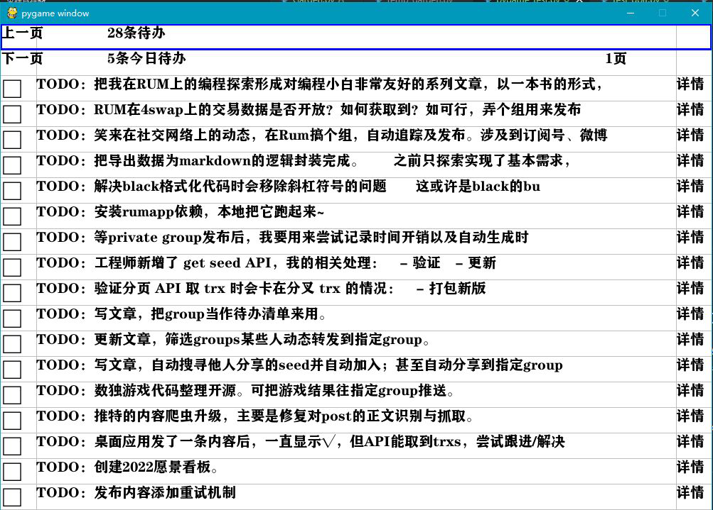

<!--trx_id:64ebc6ab-d8ba-4bdc-adcd-295d577e6af6-->

### 2022-01-04 18:56:23

发布了内容：

刚看了眼，为了用pygame把待办清单可视化，一口气坐了 3H 整。不带喝水、上厕所的。。
<!--trx_id:837cb34f-ed5f-48b4-8a88-b3f072081b2c-->

### 2022-01-05 09:21:00

发布了内容：

昨天我发了 pygame 实现的”待办清单“应用视频。有开发者建议我可以试试 flask，不过我自己的直觉是，flask 运行在 docker 里面，会不会让网络连接问题复杂化？虽然 flask 的学习成本据说比 react 低，但 rum app 自己就是 react 开发的，而且开源了，我显然觉得自己更应该去快速了解下 react。
<!--trx_id:4aa650e3-c475-4f43-a81d-029a3a2b2fc9-->

### 2022-01-05 09:22:54

发布了内容：

我请教了我们的工程师，我说看 rum app 好容易迷路。他给我指出的路是：
1、clone rum app 
2、安装相关依赖
3、然后本地把 rum app 运行起来
4、搜一个界面按钮或菜单的文本，试着改一下，观察 rum app 的改变
5、对于自己想要更改或添加的功能，继续添加相关代码试试看
接下来打算按着这个思路尝试了。学习成本要多久？我也不知道啊。。没试过。
<!--trx_id:81189c31-c513-49c6-b4df-cb888cf48ad9-->

### 2022-01-05 09:24:50

发布了内容：

但很神奇的是，过往经验证明，我在学编程相关的东西，都挺快的。快到让工程师们惊讶的地步。——当然他们大概不知道我在**上头**的状态下可以连坐好几个小时，连坐好几次。
<!--trx_id:fabc158a-fa1c-4d46-93ea-27e9cb9b2dfa-->

### 2022-01-05 09:29:58

发布了内容：

昨天并没有只做 把 待办清单 采用 pygame  GUI 化这一件事。与之相当的投入是，写了一个 Garden ，可以用来买地、种植、产出兑换券的。可以和待办清单结合使用。
我想了很多的不是以上具体逻辑或数值设计，我更多想的是，
- groups 如何生成，每个用户分别有 group 来存储 todolist 、garden 数据？还是可以一定数量的用户数据放在一个 group 以增强网络连通性？还是应该让用户选择？但这种选择几乎是不可逆的。
- 当用户需要多设备登入时，是否需要云节点来承担创建/中转及 24H 出块？
这些是与 quorum 关系更紧密的疑问。
<!--trx_id:6e5b022f-ca52-45b9-9455-81dbe93dd53f-->

### 2022-01-05 09:44:38

发布了内容：

多记录几句思考。

待办清单是私人的，用户当然不希望自己的数据被别人看到。
但我想为用户提供多设备可登入更新、为此需要提供更好的网络连通性。
让用户选择：
①当用户选择单设备时，直接采用用户本地 node 创建 group 在数据读写上是最效率的。
②当用户选择多设备登入时，则需要云节点创建group，以提供7*24H出块；但在此情况下，数据对云节点是透明的。——透明这一点，和现有互联网应用也无区别。
这种二选一是不可逆的，取决权在于谁创建了群组。

想要解决这种不可逆，可以总是让用户本地node创建group，然后云节点自动加入申请成为 producer，自动为用户提供 7*24H 出块。——提供这种服务的开发者，将需要承担用户的云节点成本。

用户可以申请额外开通 花园 功能：
可以为待办清单设定一些完成奖励，当然这是用户自定义的。
完成待办，就得到点数，阳光，水，肥的奖励，这些数值可以更新到 garden group 该用户的wallet 里。
然后用户可以自己去买地、买种子、种植、收获等。
花园的数据，我想做成公共的。所有用户申请花园功能时，就是加入这个组，初始化 wallet 然后不断更新 wallet 数值而已。
然后可视化之后，用户可以查看和交互自己的花园，也可以去逛一逛别人的花园。
增加一点交互性、可拓展空间是一方面，更重要的是，当用户同时加入花园public group，以及自己的私人的todolist group 连通性也会显著提高。

很多个人成长领域的工具，都可以基于这种思路不断地叠加上去。
我自己所知道的感恩日记，情绪日记，每天写作500字之类的均可如此尝试。

每个功能模块，其实都是为用户单独建一个组或加入公共组，每个组的数据有不同的筛选/呈现/统计逻辑，在拓展上还是很容易的。
<!--trx_id:92ae8ac2-bf9d-4b54-b589-2b74d0ebab0d-->

### 2022-01-05 09:48:02

发布了内容：

同时我也希望，用户最初可能只是被 todolist，garden 之类的个人管理工具用途所吸引。用着用着，也开始接触更多的 groups 。所以，我直接基于 rum app 开源来尝试，才容易形成这种衔接。
学习成本可能高，但距离达成目的，应该是更接近的。
<!--trx_id:0a8a2c73-f1b9-4bde-990b-afc297da2a13-->

### 2022-01-05 13:01:29

发布了内容：

终于把 rum app 在本地编译并跑起来了，还加了个简单的按钮。但按钮背后的逻辑就挺难的。。暂时绕晕在不知是 JSX 还是什么东东的语法中了。。看来可以暂停一下下，干一些其它因为沉迷编程而落下的事儿。。

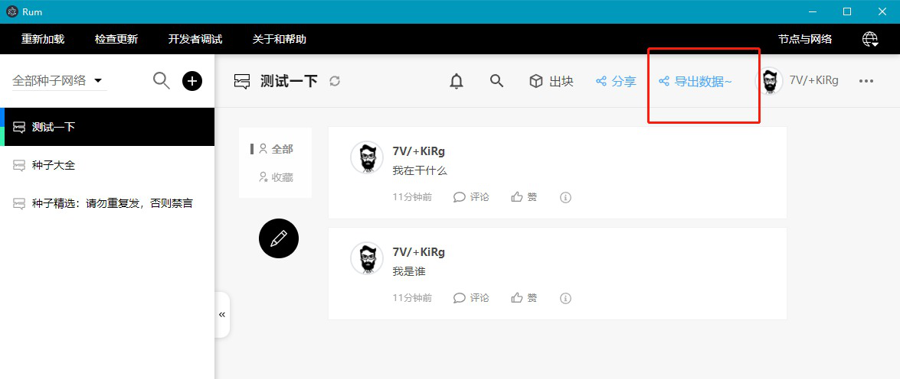

<!--trx_id:a76bb7e7-a825-413f-b830-c11690ec7203-->

### 2022-01-05 14:54:35

发布了内容：

重新听了一遍霍炬的首次直播~
<!--trx_id:4ecd7952-164a-434e-89f3-c2b55df0e3e4-->

### 2022-01-05 14:58:41

发布了内容：

今天有点过分啊。喝了 1个中杯+2个大杯 麦当劳的拿铁了。
<!--trx_id:b2264ea3-72c6-4da8-a1a2-cc055df338b4-->

### 2022-01-05 15:04:45

发布了内容：

一不小心又紧绷了。
紧绷并不一定是高效能状态。
所以，既然意识到，那就试着主动放松下来。
先把一些不那么费脑的事情，每一件都专注地做下来吧。
<!--trx_id:bd812932-a856-46f7-b929-71dea32f9a52-->

### 2022-01-05 15:54:16

发布了内容：

让用户可以自由地把数据导出，以及网络离线状态下，也可以正常访问已有数据，似乎是体现数据被自己存储的证明。
<!--trx_id:491ee30a-abc2-4300-9800-dbc97bf1500b-->

### 2022-01-05 15:55:34

发布了内容：

github 连不连得上，全靠运气啊。已经翻墙了也常常如此。

fatal: unable to access 'https://github.com/rumsystem/quorum/': OpenSSL SSL_connect: SSL_ERROR_SYSCALL in connection to github.com:443
<!--trx_id:601569b9-c4ff-412b-9d55-d1fd8eb687f4-->

### 2022-01-05 16:23:50

发布了内容：

Garden 的代码提交了~ 可以用来买地、种植、产出兑换券的。可以和待办清单（ToDoList）结合使用。
https://github.com/liujuanjuan1984/common_python_code/blob/master/JJLiu/Rum/Garden.py
挺简约的 =。= 没有 GUI，但我用python直接调用是可以玩起来的。
GUI 用 rumapp 来尝试拓展，感觉学习成本会比较大，用 pygame 来写，或许半天就写好了。不过pygame的问题在于，怎么和quorum一起打包一个独立运行的应用。
<!--trx_id:4f895bc5-69c7-45e1-9347-f884622788e3-->

### 2022-01-05 16:27:25

发布了内容：

“待办清单”采用 pygame 尝试写的图形界面，代码也提交了。封装度还不够，跑了一个实例，来读取我已经用作待办清单的group数据，然后可以去查看详情，或标记任务完成。

https://github.com/liujuanjuan1984/common_python_code/blob/master/ToDoListFE.py
<!--trx_id:61963aa5-c469-48c4-8cd0-8ace84a82cc0-->

### 2022-01-05 16:33:11

发布了内容：

数据有两种，一种更关心现状，过去每个时刻的数据历史只是为了记录现状是如何发生的，是否合理。比如 Garden 不断往 group 推送 wallet 数值（甚至应该加一点 log 文本来解释变化原因）。另一种更关心每一条数据。比如 timeline 中每条内容。
<!--trx_id:f1f475f7-7a20-4467-ab75-ae46784ca0f5-->

### 2022-01-05 16:36:19

发布了内容：

【刘娟娟的朋友圈】数据概况
创建 2021-11-22 17:40:58
最新 2022-01-05 16:33:11
Trxs>=720 条 活跃>=87 人
Trxs 详情:
- 用户信息 140 条
- 发布内容 262 条
- 评论回复 116 条
- 点赞或踩 202 条
- 其它 0 条
<!--trx_id:f73c8fb4-088b-4383-9f63-e0a2b5e76c84-->

### 2022-01-05 16:43:05

发布了内容：

自己开始写demo，就意味着有时间成本，精力成本，机会成本，于是就会不由自主地思考：这个产品的目标用户会是谁，受众面大吗，在同类产品中有竞争力吗，开发者和运营方是否能从中获利？ 这种成本意识，是单单只提需求时无法拥有/难以换位思考的。
<!--trx_id:852837b6-1dab-4078-ab96-95d8ccc62a5d-->

### 2022-01-05 17:34:13

发布了内容：

我之前发布过自己对人们对账号导出、导入的执念，其本质是中心化存储+客户端或网页/服务端架构模式之下的一种必然。但这如果延续到分布式系统上，似乎大可不必。但人们对账号导入导出需求其背后还有一个很现实的需要，采用多台设备都能看到自己所发布的所有内容，收到的所有活动/消息。于是我刚才在洗澡时，突然想到，为啥不让用户之间形成衔接呢？
用户（一个实实在在的人）
设备（一个用户会有多台设备，同一台设备也可能有多个用户，于是在同一台设备上可以支持切换账号，已经实现）
用户在设备A的账号a在groupx的pubkey为x1
该用户在设备B的账号b在groupx的pubkey为x2
x1对x2发起申请，x2同意后，上链形成一种“链接”关系，x1和x2的“链接关系”列表都有对方。
于是在设备a，x1不仅受到自己的消息，也能收到x2的消息
在设备b也如此
这种“链接”关系是可以有很多个成员加入的。比如你牛逼，有5个设备，每个设备都加入了该组，于是都可以加入到这个“链接关系”中，共享彼此的数据/消息。
<!--trx_id:e4c7fa8e-63ef-4c37-ba50-3e835a969dfc-->

### 2022-01-05 17:36:39

发布了内容：

还有一种数据是基于对已有数据的统计所形成的数据，它只在于使用者有个数据统计的概览，并不具备上链存储的价值。所以这种对数据的统计分析展示，只放在客户端也是可以的。而且趋势型数据也是可以实现的。没必要提交到链上存储。除非需要形成每日统计的快照之类的需求？以降低数据量太大时，总是需要从头计算的麻烦。
<!--trx_id:a62aaf90-1c53-4b47-b0e0-56845583ece9-->

### 2022-01-06 09:36:04

发布了内容：

今天听了定投人生课-李骏-编程课 16，还挺长的，为此早上额外多走了一点路。9000多步。
<!--trx_id:a75c686f-c8bd-45fd-9527-e33c0756ba90-->

### 2022-01-06 10:03:33

发布了内容：

李骏有个观点，JS是应该掌握的语言之一。
<!--trx_id:dade790b-bc06-4884-bd04-a6dc70541723-->

### 2022-01-06 10:11:04

发布了内容：

昨天用 rum app 已经可以跑通：点击下载按钮，弹窗让用户选择本地文件夹，然后保存数据到本地文件了。这个逻辑都是工程师在别处写好的现成的，读懂工程师写的，然后我试图拼凑成我想要的。
只是 API 不知为何一直取不到 group content 数据。
然后也找了一些 react入门、jsx语法、es6语法之类的书籍或攻略快速翻看。
无助感还是有点重的，就是从python的思维来看，多简单的逻辑啊，怎么放到react，要用js实现，它咋就这么复杂这么绕咧。——所以我就在想，我如何才能把思维从后端/运算变换到前端/交互呈现上。
<!--trx_id:e7d59901-0456-4f4a-926e-915162d448ed-->

### 2022-01-06 10:40:24

发布了内容：

其实就算想用 RUM 实现个人博客，也是可以的。反正数据逻辑都一样。只不过呈现的样式为传统 blog 罢了。然后还可以漫游、搜寻其它同类 blog。
<!--trx_id:3ce0f3c0-e5ac-4118-a718-d76b892f3698-->

### 2022-01-06 10:44:45

发布了内容：

react 有些难。我昨天至今有点纠结，是尝试更简单的前端框架，或者干脆直接用pygame 这种几乎没啥学习成本的“原型工具”。
这背后的核心，不是我个人的学习成本，关键只有两个：
① 我学这个，到底是为了干嘛？我想，我只是加深对业务的理解，或是释放想法，探索用法，写写产品demo，以及能有一点和未来的开发生态交流的底子
② 当有更多个人开发者，第三方开发团队参与进来时，什么对他们是更方便更有实效的？
react 的理念，据说是放弃模板这种高度定制化的东西，让开发团队可以从组建开始定制，开始复用，于是虽然可能开始的搭建门槛有点点高，但后续的可发展空间似乎大很多。
<!--trx_id:cef6f5f9-a347-42cb-b638-c9aa723661db-->

### 2022-01-06 11:08:16

发布了内容：

学习成本是相对于商业回报来讨论的。如果一个东西的学习成本很低，谁都可以低门槛地开始，这没啥大的问题，但有一定受众，有一定盈利能力，能持续使用的产品或服务，其还是要有商业考量的。pygame几乎就写不出来这种东西。
另外类似踢足球，贪吃蛇，flapping bird这种对新手看上去略复杂的东西，一旦拆解也挺简单的。数据量很小。。我拿 pygame 写的待办清单，数据量和业务逻辑要比游戏麻烦。。
<!--trx_id:b5dba5ef-18a4-4292-9793-cc546e2bbbc9-->

### 2022-01-06 11:12:09

发布了内容：

在 timeline 上呈现 回复给谁 这样的信息其实也好实现的 —— 假如我掌握了 react 的能力
<!--trx_id:ed091813-6bd2-45a5-a31a-45f7d08e2a87-->

### 2022-01-06 11:12:45

发布了内容：

置顶稍微麻烦点，因为要客户端保存一下，哪条trx 是置顶的
<!--trx_id:65927a69-09ea-4062-bcee-5572f0305f2c-->

### 2022-01-06 11:15:08

发布了内容：

我一方面觉得自己可以暂停代码探索，把我已经探索的所有东西，都写文章直白地表述出来，给别人以启发。
另一方面又纠结，我写的东西会不会太low了，有没有足够的价值咧？毕竟我的技术水平有几斤几两，还是有点自知之明的。
那么核心便是，我通过代码探索所看见的RUIM价值，是被掩藏的吗，是应该被直白表达出来的吗？
<!--trx_id:a0c5ff80-1459-4c5e-9f51-2dc8184e1a6d-->

### 2022-01-06 11:20:40

发布了内容：

回复自己的一条 post 并把这条回复置顶；甚至 回复之间可以形成一条 线，twitter 的这个处理还是蛮好的。比如，我就想针对之前的 某条内容补充说明。。只是通过回复来进行的话，我的关注者就无法感知到这种更新。
<!--trx_id:e77b7aa4-2a28-4666-b3fc-8365c33b1b40-->

### 2022-01-06 11:21:17

发布了回复：

那你是说：写吧写吧，我想看

回复给 `wuhao` 所发布的内容：

> 教是最好的学，娟姐写的东西学到很多

<!--trx_id:d45620bf-aafc-4254-b5e5-3925bced63e9-->

### 2022-01-06 11:22:25

发布了回复：

置顶→是指在timeline 最新那里展示，并不是固定在顶部的意思

回复给 `编程自由` 所发布的内容：

> 回复自己的一条 post 并把这条回复置顶；甚至 回复之间可以形成一条 线，twitter 的这个处理还是蛮好的。比如，我就想针对之前的 某条内容补充说明。。只是通过回复来进行的话，我的关注者就无法感知到这种更新。

<!--trx_id:a36f9719-68b3-4f24-a7f2-d18a88618e24-->

### 2022-01-06 11:36:15

发布了回复：

你是说源码，还是文章？不好懂的地方，可以随时反馈啊

回复给 `wuhao` 所发布的内容：

> 😄我在啃你写的东西呢

<!--trx_id:b047d3d6-e3aa-41da-b8be-1dd286515b35-->

### 2022-01-06 14:23:59

发布了内容：

一片很黄很黄、很大很大的叶子~

<!--trx_id:f0e221bf-95e6-4ed8-94a3-878b5a0fda3c-->

### 2022-01-06 14:42:31

发布了内容：

【刘娟娟的朋友圈】数据概况
创建 2021-11-22 17:40:58
最新 2022-01-06 14:23:59
Trxs>=748 条 活跃>=87 人
Trxs 详情:
- 用户信息 140 条
- 发布内容 277 条
- 评论回复 121 条
- 点赞或踩 210 条
- 其它 0 条
<!--trx_id:287daa44-e310-40dc-9f63-880ae3d4e359-->

### 2022-01-06 16:26:45

发布了内容：

从2017年秋至今的时间开销数据，有 34000多行，无论是用 excel 还是记事本打开，都卡的不行，更别提修改、计算这种事情了。幸好我会 pandas...
<!--trx_id:cb7e6f15-77ac-4ae7-a502-1abef67183ac-->

### 2022-01-06 16:42:11

发布了内容：

既然无论如何时间都会过去，为什么不选择做些有意义的事情呢
<!--trx_id:c82138e4-5ab9-4788-846f-ebf706b4f214-->

### 2022-01-07 00:08:45

发布了内容：

【刘娟娟的朋友圈】数据概况
创建 2021-11-22 17:40:58
最新 2022-01-06 16:42:11
Trxs>=752 条 活跃>=87 人
Trxs 详情:
- 用户信息 140 条
- 发布内容 280 条
- 评论回复 121 条
- 点赞或踩 211 条
- 其它 0 条
<!--trx_id:d669fa2e-6872-49b4-bc46-0fdc69e9447d-->

### 2022-01-07 00:11:26

发布了内容：

最近我加的代码有点多，有些之前group bot要一起升级了。。所以请耐心等待明天升级。
<!--trx_id:90e488d5-afa8-44ba-87ac-e9a66cf54090-->

### 2022-01-07 01:12:12

发布了内容：

black的那个语法错误还是给我自己挖坑了。。
<!--trx_id:eb2e7f44-f52f-4ff5-a205-cb922fd406a9-->

### 2022-01-07 01:13:51

发布了内容：

'\"' 虽然 等同于 '"' 可是在传入 RUM 时，就是不同，就是需要对 " 加一个 \符号处理。。
<!--trx_id:78f848fc-6c46-44ea-98c2-2be10fdfa48e-->

### 2022-01-07 01:21:13

发布了内容：

【刘娟娟的朋友圈】数据概况
创建 2021-11-22 17:40:58
最新 2022-01-07 01:13:51
Trxs>=756 条 活跃>=87 人
Trxs 详情:
- 用户信息 140 条
- 发布内容 284 条
- 评论回复 121 条
- 点赞或踩 211 条
- 其它 0 条
<!--trx_id:e66cb944-a9c8-44a2-b16f-7dc0373a2ac4-->

### 2022-01-07 01:28:03

发布了内容：

困
<!--trx_id:6ef3553d-ce5e-4b55-a681-ce32a4506a91-->

### 2022-01-07 01:29:09

发布了内容：

定位并修复一个问题，花了一个多钟。发现这个问题，是一个发现很久但一直没彻底解决的问题：black自动格式化时，把 str.replace('"','\"') 的代码意图给抹掉了。
<!--trx_id:f0c8fce1-b1f4-4676-b507-f3c9661c462f-->

### 2022-01-07 01:29:39

发布了内容：

真是一个毫无营养的bug，可以先去昏昏大睡了。
<!--trx_id:fac4ed58-6dda-471c-bc8c-a6fde34c20d5-->

### 2022-01-07 10:48:38

发布了内容：

我最近写的 RUM 相关的 Python 代码，已经都放在这里：
https://github.com/liujuanjuan1984/common_python_code/tree/master/JJLiu/Rum

说明：

- API：对 quorum API 的一个简单直接的调用
- Content/Group/Node/Trx：对象相关的方法，通用的，以及我个人需要用到的

几个具体的应用：
- SearchSeeds：自动搜索自己所加入的所有组中被分享的种子、自动加入、自动推送到指定group（比如种子大全）
- ToDoList：把 Group 作为待办清单来用，约定了一些规则，比如“TODO：”开头的post表示一条新的待办等等
- Garden：和ToDoList合用或单独用，其实只是一直往group更新自定义的wallet数据，用来实现买地、种植、阳光、水、肥、点数等资源的获得、消耗
- WhoSays：检索某人在多个groups的发言，并转发到指定组（一个实例，Huoju在Rum说了啥）

../ToDoListFE.py 用 pygame 包装的一个 ToDoList 的前端
../Scrawler.py + ../Weibo ：爬虫，从 twitter/weibo 爬取指定一些人的内容，自动截图+文本，推送到group

我想要的是：这些代码是否值得分享出来，以一种能启发他人的方式？

目标受众：
1、懂点python，不用写前端，可以直接本地跑点python代码来自动化操作的人
2、对go还不太熟悉，但是想要试试 quorum 能做什么的人（可能python会的人比较多，就算不会，只是看看quorum能做什么，也会简单许多）

我担心的是，如何分享出来更合适？我担心的是
- 不懂的人看不懂？我可以补ipynb文章来说明
- 懂得人觉得太业余？是否有工程师感兴趣起一个 python 的库，把专业的架子搭出来？
<!--trx_id:2c0634ba-e2a9-4bf4-925e-1578cdb0684b-->

### 2022-01-07 11:11:39

发布了内容：

昨晚只睡了5个小时，但...早上户外的冷风一吹，咖啡一喝，走了些路，思维还是挺活跃的。也不知道中午有没有办法能睡着一会儿。
<!--trx_id:33e4ecb5-de33-43dc-9b15-29b4cebc01f8-->

### 2022-01-07 12:21:20

发布了内容：

这句话并不是笑话，真的是新手的必经之路啊：

> 我不是在写 bug ，就是在 改 bug
<!--trx_id:48edbb81-82a0-4c54-bb74-f35f390919ad-->

### 2022-01-07 14:46:44

发布了内容：

不统计不知道，原来我用在编程上的时间已经超过了 1000H 了
<!--trx_id:9b5e973c-978e-4f4d-92d3-4174e0decfbe-->

### 2022-01-07 14:47:05

发布了内容：

怪不得有似乎跨越了学习成本线的感觉
<!--trx_id:2d714b9c-912f-4d5b-b743-26ad2d7ee743-->

### 2022-01-07 16:21:16

发布了内容：

嗯。

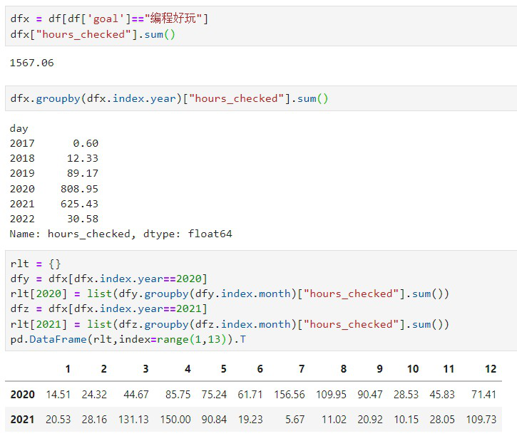

<!--trx_id:b53cd7cf-81b7-46c5-940e-a41e61d1161d-->

### 2022-01-07 16:26:19

发布了内容：

ε=(´ο｀*)))唉  这几年仍在各种毫无营养的事情上的时间，绝对比编程的时间多。。
<!--trx_id:e2094ac6-bc6c-4754-9b93-8692226f1678-->

### 2022-01-07 16:26:39

发布了内容：

每一分钟时间，即每一分钟生命。
<!--trx_id:f31b3c40-b788-48c5-8f70-7996fb8bfe55-->

### 2022-01-07 16:32:30

发布了内容：

编程这个技能，我一直是实践驱动学习的，大白话就是：如果用不上，我大概率不会去学。
起因是笑来写了《自学是门手艺》这门书，然后我们要开始搞xue这个项目了。都做编程产品了，我自己不懂编程是不行的，所以就开始学。最大的实战，是为XUE更高效率地做内容编辑、内容配套、增长运营实验、数据分析。有时也拿来给自己做一些自动化工具。
21年底减少投入，是某次霍炬说，我的能力只是做xue内容有些浪费，所以我就暂停了。最近因为对RUM开发的探索，又重新增多了投入。
实践并非“任务”导向的，而是探索/意识到，如果我会编程，效率或效果应该更好，于是就快速学中用，用中学。
<!--trx_id:f55e80a5-b74f-4888-ad76-c962981672b0-->

### 2022-01-07 16:37:11

发布了内容：

我不参与RUM底层或APP的开发，它们需要的是商业级可用代码，—— 把写优质代码，这个定位放在我身上肯定是不恰当的。
我的探索视角更像是开源项目有可能吸引到的个人开发者，编程学习者，或者非Go/JS语言使用者，他们刚开始接触 RUM 这个开源项目时的可能体验/感受。
但我又似乎可以开始扮演传达者的角色。把我的开发探索，转化为易读的文章和攻略，让那些潜在的生态开发参与者们接触到。
<!--trx_id:1d10f382-4067-4bfe-86f2-2d53f749c039-->

### 2022-01-07 16:40:43

发布了内容：

在我弄懂了“我应该懂”的知识后，我更有价值的投入，是把它们文章化，让这一系列文章产生吸引力。
—— 什么是我应该懂的？这是一个很有趣的思考。
我更有价值的投入，应该不是写出更专业的代码，让别人无可挑剔——这当然会是我潜意识中想要提升代码能力的一个背景音，但它不重要，真的不那么重要。
要摆脱这种冲上了一个山峰，想要再冲下一个山峰的冲动。要停下来，想一想，如何让阶段价值固化并`多维度`放大。
<!--trx_id:cc2c8703-7a7c-4cb2-93b3-149668e2480d-->

### 2022-01-07 16:43:25

发布了内容：

选择做正确的、困难的事情，然后让时间发酵价值。
<!--trx_id:8da9f1b8-bfa8-4abf-a2a9-23a0dbc74b35-->

### 2022-01-08 00:00:04

发布了内容：

【刘娟娟的朋友圈】数据概况
创建 2021-11-22 17:40:58
最新 2022-01-07 16:43:25
Trxs>=774 条 活跃>=87 人
Trxs 详情:
- 用户信息 140 条
- 发布内容 300 条
- 评论回复 121 条
- 点赞或踩 213 条
- 其它 0 条
<!--trx_id:8ed9f091-007a-4222-b1c6-47ce238f18d0-->

### 2022-01-08 11:22:09

发布了内容：

我们小区有两个宝藏老师，一个是女性瑜伽老师，一个是男性绘画老师。最近给俩娃报名了绘画课，60节课，2500元，家长自己看时间送娃去上就好了，直至课时用完。老大学素描，老二学丙烯画。然后我就给娃买了24色丙烯颜料（每瓶500毫升），素描全套笔。俩娃的风格很有趣，哥哥小心谨慎，怕犯错；妹妹挥洒肆意，虽然也怕犯错，但下笔很潇洒。有次接妹妹放学，看到她的画纸上还有几处明显的“问题”，我就忍不住去”帮“她涂，涂完一对比，就忍不住感慨：我这补的看上去就很刻意啊。
<!--trx_id:5b1f4aaa-2791-4d9f-abe7-9ef8d35d92ed-->

### 2022-01-08 11:31:36

发布了内容：

昨天丙烯颜料到货，画纸也到货，刚吃过晚饭不久，俩娃就热切地想要绘画。于是我张罗着用两张木椅子给他们当画板，用纸胶布贴上画质四边，然后不断地开颜料瓶，挤颜料。妹妹不画线稿，上手直接画：三个三人儿，青青草原，蓝蓝天，飞机，树，太阳。然后着急于“完成了，可以揭掉纸胶布了吧？” 
我看到她剩下的颜料，心想有点浪费，那我也画一个吧。就从女儿的手绘书中翻了一页，画线稿，填色从大块到小块，补细节，往干了的块补其它色。。
“妈妈画得真像”，“很像”，这是孩子们的评价。——我本能觉得，“像”不是绘画的最重要的目的。
不过拍照发给老师后，老师的评价我更钟意：颜色搭配和构图都比较中规中矩，场景线条可以更加多变，画面看起来会比较自然；建议可以找摄影图片进行作画，用自己的思想作画，画面效果会完全不同。
手动画重点，那便是：颜色搭配、构图、场景线条、画面自然、表达自己的思想。

<!--trx_id:9ffbdff1-9ff9-499c-8bbd-b2bede4f3da6-->

### 2022-01-09 00:00:02

发布了内容：

【刘娟娟的朋友圈】数据概况
创建 2021-11-22 17:40:58
最新 2022-01-08 13:14:41
Trxs>=780 条 活跃>=87 人
Trxs 详情:
- 用户信息 140 条
- 发布内容 303 条
- 评论回复 121 条
- 点赞或踩 216 条
- 其它 0 条
<!--trx_id:a999ca01-4641-4309-b259-6a295b3e2a5a-->

### 2022-01-09 11:28:14

发布了内容：

晚上没睡够，上午虽然照例户外快走、喝咖啡，但那脑袋已经完全不是自己的了。耳机里不管输入的是什么信息，几乎都不做停留地，原样溜走。思维活动或许有，可那质量堪忧。
我得到无数次的教训是，有女儿这样的生物钟在旁，我是绝对不可以晚睡的...
时间永远不会因为你晚睡而多出几个小时，也绝对不会因为你早起而多出几个小时，它永远都是忠实于 24 H小时。你不遵循节律，就会被它伤害。
<!--trx_id:2fe2f6de-4a60-4f7e-95b2-2e973b2221ed-->

### 2022-01-09 11:29:45

发布了内容：

儿子的期末考成绩出来了，烂的一批。户外快走时，我的一大任务就是放空，希望不要产生负面情绪，不要着急制造方案。而是等自己状态好一点，再和孩子面对面规划一下。更重要的是，规划之后，持之以恒地花精力去确保执行。
<!--trx_id:a942fc78-522b-48cd-9f6c-b4140f6bf59e-->

### 2022-01-10 09:34:15

发布了内容：

老大放假了，老二还没有。今早户外快走，拉上老大一起~ 还是得给他找台手机，配上耳机，各自走，各自听。这样我也能回到难得的独处时段了。
<!--trx_id:8ea9b8d4-7f40-41c4-be67-d8730b2d17f6-->

### 2022-01-10 10:03:40

发布了内容：

【刘娟娟的朋友圈】数据概况
创建 2021-11-22 17:40:58
最新 2022-01-10 09:51:13
Trxs>=794 条 活跃>=87 人
Trxs 详情:
- 用户信息 141 条
- 发布内容 307 条
- 评论回复 123 条
- 点赞或踩 223 条
- 其它 0 条
<!--trx_id:61e2b44d-2817-46cc-8260-952630dfbd92-->

### 2022-01-10 10:07:28

发布了内容：

笑来老师终于在微博提“安息年”这个说法了。有种靴子落地的赶脚。
<!--trx_id:c5ae4a17-12c8-4e81-8b6f-a8d32bb2904c-->

### 2022-01-10 12:16:14

发布了内容：

参照 wechatpy 写 rumpy，专业级的 repo 果然不同凡响。。真他妈专业
<!--trx_id:3e63d1d8-6737-4c6e-aeb8-4e33f66d958e-->

### 2022-01-10 12:17:01

发布了内容：

必须要表达下，专业在哪里：把 client 抽象出来，作为调用的交互对象，api只是服务于 client 的。
<!--trx_id:6aca56a2-a19a-4d71-b3a3-838a7f7aab12-->

### 2022-01-11 00:00:22

发布了内容：

【刘娟娟的朋友圈】数据概况
创建 2021-11-22 17:40:58
最新 2022-01-10 17:35:36
Trxs>=806 条 活跃>=88 人
Trxs 详情:
- 用户信息 147 条
- 发布内容 311 条
- 评论回复 123 条
- 点赞或踩 225 条
- 其它 0 条
<!--trx_id:6bcfaad9-7792-4e15-b639-2c3d8d6a4816-->

### 2022-01-11 00:06:20

发布了内容：

献丑了 https://github.com/liujuanjuan1984/rumpy
<!--trx_id:77e39097-e02c-45ab-b4c6-cf5a37ec46b3-->

### 2022-01-11 10:14:13

发布了内容：

专业写python的人点评说，
> “我大概看过，我觉得写的挺好的” 
这实在令我开心。
另外，我也如此认为。
<!--trx_id:be6dae18-5cea-4ec9-ad4b-8b62c6692312-->

### 2022-01-11 10:15:20

发布了内容：

虽然开始讨论在哪里过年的话题，可是讲实话，我实在没有“过年”的觉悟。顶多苦恼的是，娃放假了，该如何让他们少粘着我的同时，又不至于过得不太健康。
<!--trx_id:f2cea383-a336-40e7-966e-12749914b14d-->

### 2022-01-11 11:15:37

发布了内容：

通了！通了！通了！
- api主要逻辑都放到了 rumapi 内；
- whosays 作为 example 发布，
- GET:seed 采用最新 quorum main 编译包； 
- whosays 转发逻辑支持了图片。

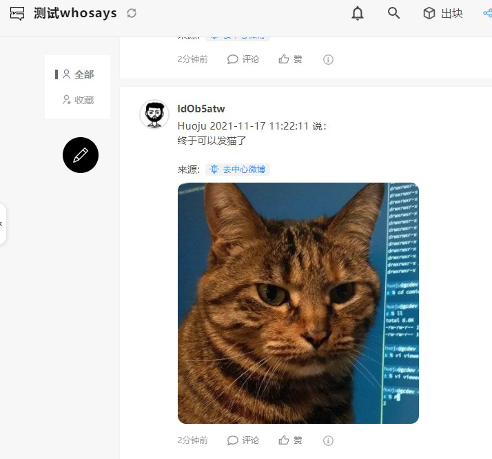

<!--trx_id:2095783a-01ad-4e18-80b3-442b6960c692-->

### 2022-01-11 11:15:50

发布了回复：

- api主要逻辑都放到了 rumpy 内；

回复给 `编程自由` 所发布的内容：

> 通了！通了！通了！
> - api主要逻辑都放到了 rumapi 内；
> - whosays 作为 example 发布，
> - GET:seed 采用最新 quorum main 编译包； 
> - whosays 转发逻辑支持了图片。

<!--trx_id:7e0a9694-e766-451f-bff5-68376ca30fe6-->

### 2022-01-11 11:17:26

发布了内容：

刚需：搜索+移除无用的组。

<!--trx_id:8dc5106b-af42-4846-a747-7a743dd0d321-->

### 2022-01-11 11:18:36

发布了内容：

对于正在做的事情，被肯定值得做，是世界上最开心的事情了。
<!--trx_id:325d9e97-5c2f-43df-a844-36d353e9b94c-->

### 2022-01-11 12:10:23

发布了内容：

把自己编译的 quorum.exe 和生成的 certs 直接去覆盖 live 环境安装所用的，这个大胆尝试可真有趣。
<!--trx_id:96bb4cfc-7028-479b-a705-0d73b37a18f6-->

### 2022-01-11 12:19:24

发布了回复：

可以的呀

回复给 `wuhao` 所发布的内容：

> 覆盖了还能用吗

<!--trx_id:e6682a73-3b51-4704-bcd1-13d8bb20012e-->

### 2022-01-11 12:23:14

发布了内容：

运行 quorum 要读取本地数据文件时，记得 peername 这个参数要和本地数据文件的peername 一致。默认是 peer，具体去看 peerData 下的文件夹是以什么打头来命名的。

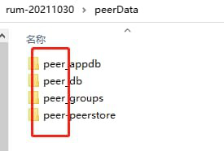

<!--trx_id:3b6df61e-138d-4806-88b4-481a59098641-->

### 2022-01-11 12:33:49

点赞给 `编程自由` 发布的内容。

> 刚需：搜索+移除无用的组。

<!--trx_id:1336a432-44c4-4296-9ca3-4cf882b1dcc0-->

### 2022-01-11 12:33:55

发布了回复：

完成了。

回复给 `编程自由` 所发布的内容：

> 刚需：搜索+移除无用的组。

<!--trx_id:83d92a20-3516-4af8-8af3-83d6ab3224e1-->

### 2022-01-11 14:20:19

发布了内容：

有时候户外快走，会带来很活跃的思维状态，并产生不少创意，灵感，下一步行动，或者回顾之前做过的，产生了更好的迭代想法。我承认， 这让时间价值感大大提升。但是总是追求户外快走时必须有令自己满意的产出，未尝不是一种病态。
放空大脑，活动四肢，让身体健康，让思维暂停，又或者晒太阳，观察自然环境，这些也是户外快走的魅力所在。
<!--trx_id:b592a80b-b287-4523-8bc6-d42fd51e2f63-->

### 2022-01-11 16:48:25

发布了内容：

第一次，用 github 的 releases/tag 功能。虽然早期，但这个版本是可用的~

https://github.com/liujuanjuan1984/rumpy/releases
<!--trx_id:32e012d2-e4ac-4690-849c-d86c91f5a0c8-->

### 2022-01-11 18:38:21

发布了内容：

在做数据导出功能。打算完成后作为 rumpy 的 examples 发布

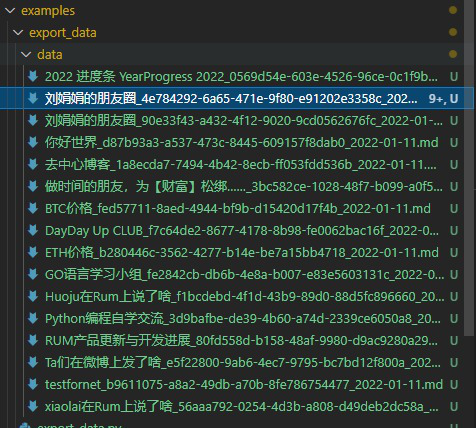

<!--trx_id:0be150a5-c02a-4a45-8edb-314401a3d9f7-->

### 2022-01-11 18:40:33

发布了内容：

现在想想看，如果想要通过行为激励来释放 rum ，鼓励用户活跃，那么一大困难便是我们这些会编程的人所开的大量 bot。这其实无需预测，这就是如今互联网的现状，只要有利可图，bot就一定会存在。坚守价值激励，确实是 rum 应该做的事情。
<!--trx_id:b35df637-a166-478f-b82a-a45f7fdefb71-->

### 2022-01-12 12:39:00

发布了回复：

{'genesis_block': {'BlockId': 'e5a6d860-112d-4efb-b9b3-db145a966f1c', 'GroupId': '6ab9a28b-51b1-4d1a-8e37-86a9806cbf9a', 'ProducerPubKey': 'CAISIQLHH+h3hgBiJLA+LiURYGYCuq/KGrG+iE50St3bMjrTXw==', 'Hash': '93BmRcA4OBl11vZV92apIFxBAYWPrNdrznGq6OtqK80=', 'Signature': 'MEUCIEgg1JD3Py72LQNbf9b6fVAgWA69esx/PaE1M+VSLfqEAiEA2v/TF17/Nx7uD7Ch1Mn5nRraLqd1rZ/8eCJNjKazftQ=', 'TimeStamp': '1641962301919346200'}, 'group_id': '6ab9a28b-51b1-4d1a-8e37-86a9806cbf9a', 'group_name': '测试一下', 'owner_pubkey': 'CAISIQLHH+h3hgBiJLA+LiURYGYCuq/KGrG+iE50St3bMjrTXw==', 'consensus_type': 'poa', 
'encryption_type': 'public', 'cipher_key': '78dd1549724ee7916e4b65821e4fc391d591494727b459f9157936c645305b8a', 'app_key': 'group_timeline', 'signature': '304502204b883188b0b76b24ea237d7d5d8187a4cd1a47059440fa7ccdd0c55f0f19fcf1022100be1d2dc6935646467578eea10f002206e517e65dc25727ef04c51cb5a05e7234'}

回复给 `编程自由` 所发布的内容：

> 现在想想看，如果想要通过行为激励来释放 rum ，鼓励用户活跃，那么一大困难便是我们这些会编程的人所开的大量 bot。这其实无需预测，这就是如今互联网的现状，只要有利可图，bot就一定会存在。坚守价值激励，确实是 rum 应该做的事情。

<!--trx_id:eaf17868-d53d-4301-a7ef-83690bf1b094-->

### 2022-01-12 14:24:01

发布了内容：

绕晕在 dataclass 里了。直接用它是简单的。但绕晕我的地方在于 …… 我必须要试图描述清楚我的问题，一旦做到清晰描述，答案就唾手可得了。

绕晕我的地方在于：
1、自定义 dataclass ，是为了做类型检查，为了让使用者更方便，
但作为类的方法的参数传入时，如何触发类型检查？
我可以为某个参数指定为 Dict 或 List 类型，一个 dataclass 的实例，如何做类型检查？

2、自定义数据类型，只是对 已有类的方法中的参数或返回值进行的封装。而不是作为一种对象类型。
对象，和对象数据类型，这两者如何交互？

3、不同api得到的数据字段不同。比如 trx，我通过 GET: group/content 拿到的，和 通过 GET: trx/group_id/trx_id 就不同。
基于api层的不同，我上层又该如何封装？

4、我可以为 trxdata 自定义 dataclass 类型，但它似乎又显然不是 api.RumTrx ，也不是 Trx 这个对象。。
<!--trx_id:2d32c633-2bfa-4c30-8b12-d2d05e4ef153-->

### 2022-01-12 14:25:24

发布了内容：

解决问题的钥匙，肯定不是那问题之门的锁孔里。
令人头昏脑涨的问题，那就暂时放一放吧。
<!--trx_id:6aa9203c-c189-48e6-a3fa-a15547488076-->

### 2022-01-12 15:18:15

发布了内容：

继续数据导出功能。转换为可阅读性较强的 markdown。这样的视觉效果可还好？
左侧：，markdown源文件，右侧，渲染后。

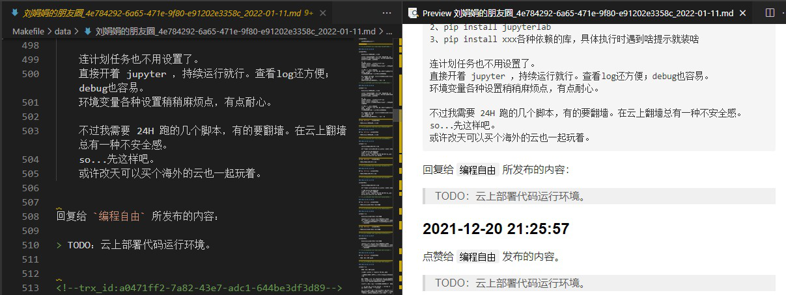

<!--trx_id:bf7b2659-66ca-471c-bce3-e857d1b435eb-->

### 2022-01-12 19:41:47

发布了内容：

这个实现，诱人点击 → 诙谐一笑
拿来生成病毒传播的物料，如何？

<!--trx_id:ce344b7c-53d9-42ed-8697-441fba9c02b6-->

### 2022-01-12 22:57:08

发布了内容：

对 dataclass 有一种开窍的感觉。但不打算熬夜了。好好睡觉，白天单位时间效能更高。
<!--trx_id:a97fbce5-4f2c-4595-8aa8-acb2fc8de88f-->

### 2022-01-12 23:00:16

发布了内容：

【刘娟娟的朋友圈】数据概况
创建 2021-11-22 17:40:58
最新 2022-01-12 22:57:08
Trxs>=849 条 活跃>=88 人
Trxs 详情:
- 用户信息 150 条
- 发布内容 329 条
- 评论回复 129 条
- 点赞或踩 241 条
- 其它 0 条
<!--trx_id:9051130a-fe92-49cc-b0e3-a7f8c74290b6-->

### 2022-01-13 00:00:58

发布了内容：

【刘娟娟的朋友圈】数据概况
创建 2021-11-22 17:40:58
最新 2022-01-12 23:13:13
Trxs>=851 条 活跃>=88 人
Trxs 详情:
- 用户信息 150 条
- 发布内容 330 条
- 评论回复 129 条
- 点赞或踩 242 条
- 其它 0 条
<!--trx_id:fd6cc84e-c305-4d14-a9fc-31a40aa8a192-->

### 2022-01-13 09:43:19

发布了内容：

大胆点 =。=

<!--trx_id:4b59cb92-c0ba-43f1-b818-c4e90c383016-->

### 2022-01-13 10:38:18

点赞给 `2号酒桶` 发布的内容。

> 

<!--trx_id:06f5716d-08e0-4f32-83fb-d709a0035008-->

### 2022-01-13 10:38:48

点赞给 `2号酒桶` 发布的内容。

> 

<!--trx_id:f7cda495-3c80-44e3-9d35-082e1da44f01-->

### 2022-01-13 10:40:36

点赞给 `2号酒桶` 发布的内容。

> 

<!--trx_id:46fb0448-e4fb-46c8-8a11-369c08bbc05a-->

### 2022-01-13 11:03:27

点赞给 `2号酒桶` 发布的内容。

> 

<!--trx_id:b55de173-ce47-4ead-8b27-1e3801c4ad3e-->

### 2022-01-13 11:03:52

发布了回复：

你好

回复给 `2号酒桶` 所发布的内容：

> 

<!--trx_id:341beba3-ce21-4743-a2b2-7f768766d14c-->

<!--bot author: liujuanjuan1984, https://github.com/liujuanjuan1984/rumpy -->
